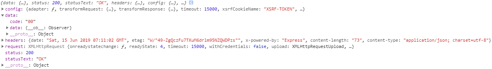
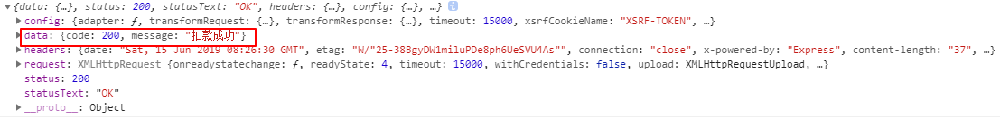
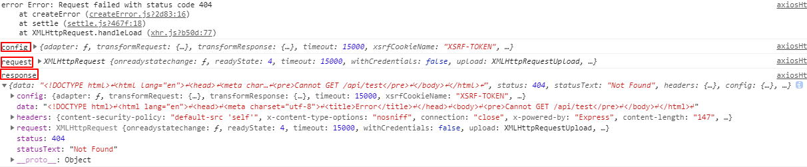
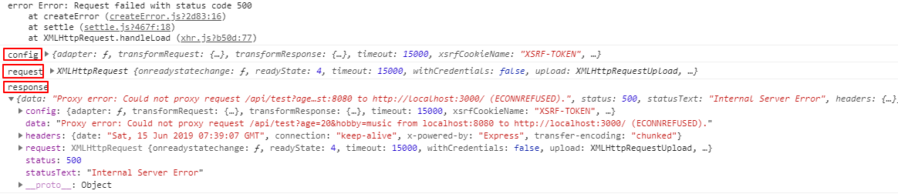
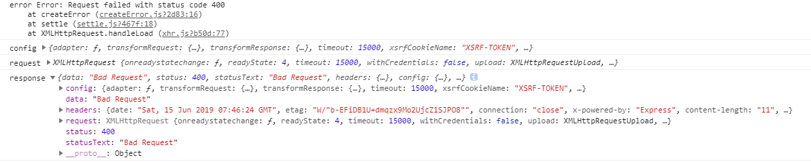
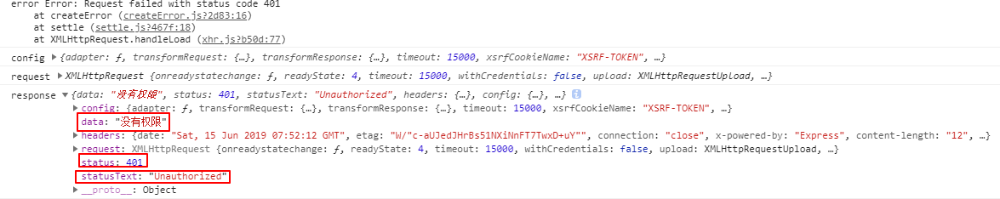

# node

```js
// 添加响应拦截器
axios.interceptors.response.use(function (response) {
  // 对响应数据做点什么
  console.log(response) // ----------节点1----------- response.status 和 response.data.status
  return response;
}, function (error) { // ----------节点2----------- error.response.status 和 error.response.data.status
  // 对响应错误做点什么
  console.log(error)
  for (let key in error) {
    console.log(key, error[key])
  }
  return Promise.reject(error);
});
```
## 1 走节点1

1 请求成功 `response.status === 200`


2 客户端和服务器端都正常，请求成功，服务器根据客户端上传的参数信息，返回异常响应
某人账号100元余额，现要对该账户进行扣款，如果输入扣款金额40元，那么提交扣款接口可以成功扣款，返回

```js
response.data === {
  code: 200,
  message: '扣款成功！'
}
```


如果输入扣款金额120元，由于扣款金额大于账户余额，因此扣款失败，返回

```js
response.data === {
  code: 100,
  message: '扣款失败！'
}
```
## 2 走节点2

1 请求不存在的接口 `error.response.status === 404`


2 关闭服务器（即服务没启动） `error.response.status === 500`


3 用户发出的请求有错误

```js
// 服务器代码
router.get('/api/test', (req, res) => {
  res.status(400).send({ // 前后端已经约定好数据格式，即使请求错误，要返回该格式的错误信息给前端
    status: 400,
    message: '请求有错误'
  })
})
```


4 用户没有权限

```js
// 服务器代码
router.get('/api/test', (req, res) => {
  res.status(401).send({
    status: 401,
    message: '用户没有权限'
  })
})
```

