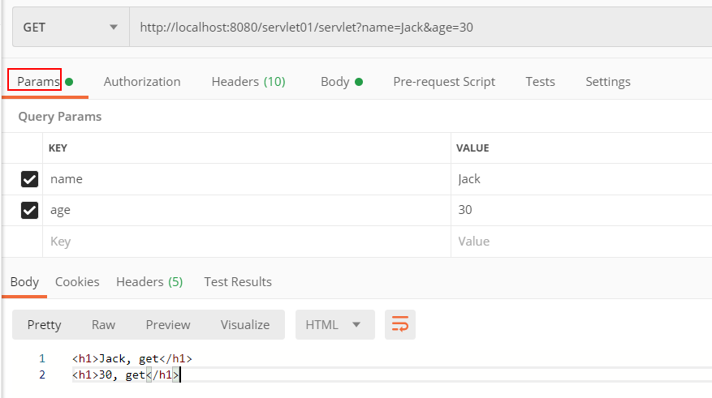

# Content-Type

- MDN[Content-Type](https://developer.mozilla.org/zh-CN/docs/Web/HTTP/Headers/Content-Type)
- [四种常见的 POST 提交数据方式](https://www.cnblogs.com/Zhaols/p/6274899.html)
- [四种常见的 POST 提交数据方式](http://yijiebuyi.com/blog/b0b830b8119be778aa099ebb21333edc.html#)

GET请求方式，参数是拼接在url后传递的，因此在请求中不需要设置`Content-Type`

## 1 作用

- 在请求中 (如POST 或 PUT)，客户端告诉服务器实际发送的数据类型（编码格式）。
- 在响应中，Content-Type头告诉客户端实际返回的内容的内容类型。

## 2 语法

`Content-Type`的值可以由三部分通过`;`连接组成:

- media-type 资源或数据的 MIME type
- charset 字符编码标准
- boundary 对于多部分实体，boundary 是必需的，其包括来自一组字符的1到70个字符，已知通过电子邮件网关是非常健壮的，而不是以空白结尾。它用于封装消息的多个部分的边界。
如：

```http
Content-type: text/html;chartset=UTF-8
Content-type: multipart/form-data;boundary=something
```

XMLHttpRequest对象设置请求头 xhr.setRequestHeader('Content-type', 'xxx')，此方法必须在open()方法和send()之间调用（否则会报错），如

```js
var xhr = window.XMLHttpRequest ? new XMLHttpRequest() : new ActiveXObject("Microsoft.XMLHTTP")
xhr.onreadystatechange = function () {
    if (xhr.readyState === 4 && xhr.status === 200) {
    console.log(xhr)
    console.log(typeof xhr.response) // string
    console.log(xhr.response) // 返回响应正文
    }
}
xhr.open('POST', '/api/info')
xhr.setRequestHeader('Content-type', 'applition/json;charset=UTF-8')
xhr.send('userName=zbx')
```

axios 设置请求配置中的headers，如

```js
axios.request({
  method: 'post',
  url: '/login',
  data: {
    userName: 'admin',
    pwd: '123456'
  },
  headers: {
    'Content-type': 'applition/json;charset=UTF-8'
  }
})
```
## 3 种常用的Content-type

### 3.1 application/x-www-form-urlencoded;charset=UTF-8

`<form>`属性enctype、jquery ajax 配置项contentType的默认值都是这个。参数以`key1=val1&key2=val2&key3=val3`形式传递。如
```
POST http://www.example.com HTTP/1.1
Content-Type: application/x-www-form-urlencoded;charset=UTF-8

title=test&sub%5B%5D=1&sub%5B%5D=2&sub%5B%5D=3
```

### 3.2 multipart/form-data

这又是一个常见的 POST 数据提交的方式。我们使用表单上传文件时，必须让 form 的 enctyped 等于这个值。请求格式如下

```
POST /info HTTP/1.1
Content-Type:multipart/form-data; boundary=----WebKitFormBoundaryrGKCBY7qhFd3TrwA

------WebKitFormBoundaryrGKCBY7qhFd3TrwA
Content-Disposition: form-data; name="name"

zbx
------WebKitFormBoundaryrGKCBY7qhFd3TrwA
Content-Disposition: form-data; name="pic"; filename="chrome.png"
Content-Type: image/png

PNG ... content of chrome.png ...
------WebKitFormBoundaryrGKCBY7qhFd3TrwA--
```

### 3.3 text/xml

XML-RPC（XML Remote Procedure Call）。它是一种使用 HTTP 作为传输协议，XML 作为编码方式的远程调用规范。典型的 XML-RPC 请求是这样的：
```
POST http://www.example.com HTTP/1.1
Content-Type: text/xml

<!--?xml version="1.0"?-->
<methodcall>
    <methodname>examples.getStateName</methodname>
    <params>
        <param>
            <value><i4>41</i4></value>

    </params>
</methodcall>
```

### 3.4 application/json;charset=UTF-8

实际上，现在越来越多的人把它作为请求头，用来告诉服务端消息主体是序列化后的 JSON 字符串。可以方便的提交复杂的结构化数据，特别适合 RESTful 的接口。如
```js
var data = {'title':'test', 'sub' : [1,2,3]}
this.$axios.post(url, data).then(() => {
  ...
})
```
最终发送的请求是
```
POST http://www.example.com HTTP/1.1
Content-Type: application/json;charset=utf-8

{"title":"test","sub":[1,2,3]}
```

## 5 知识点

上传文件时除了通过下面这种方式
```html
<form action="/info" method="post" enctype="multipart/form-data" id="form">
  <input type="text" name="name">
  <input type="file" name="pic">
  <input type="submit" value="提交">
</form>
```

```
POST /info HTTP/1.1
Content-Type:multipart/form-data; boundary=----WebKitFormBoundaryrGKCBY7qhFd3TrwA

------WebKitFormBoundaryrGKCBY7qhFd3TrwA
Content-Disposition: form-data; name="name"

zbx
------WebKitFormBoundaryrGKCBY7qhFd3TrwA
Content-Disposition: form-data; name="pic"; filename="chrome.png"
Content-Type: image/png

PNG ... content of chrome.png ...
------WebKitFormBoundaryrGKCBY7qhFd3TrwA--
```

也可以通过
```js
var formData = new FormData()
formData.append('name', inputnputElement.value)
formData.append('name', fileInputElement.files[0]) // fileInputElement表示上传控件
var request = new XMLHttpRequest();
request.open("POST", "http://foo.com/submitform.php")
request.send(formData)
```

在使用postman调用接口时，如果请求方式时get，只能在Params下添加参数




