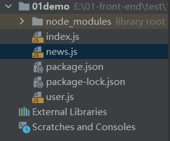
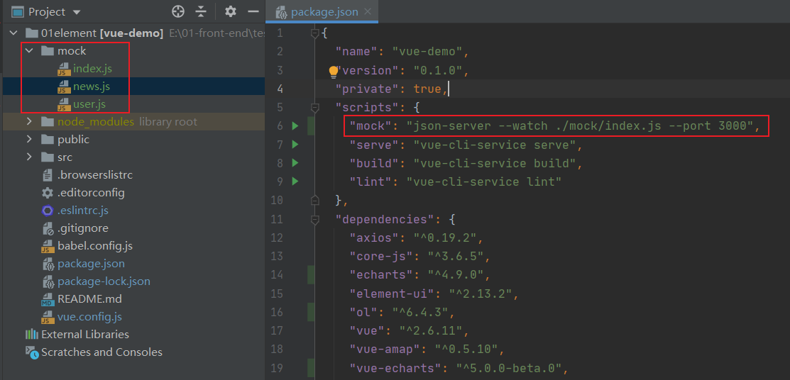

# json-server+mockjs 模拟REST接口

[json-server+mockjs 模拟REST接口](https://www.cnblogs.com/aaron-pan/p/7234190.html)

[json-server-router](https://github.com/advence-liz/json-server-router/blob/master/README-zh_CN.md)

使用 json-server 生成一个服务器，提供 RESTful 风格 API，使用 mockjs 生成随机数据。

虽然 json-server 本身也支持[生成随机数据](https://github.com/typicode/json-server#generate-random-data)，其实就是使用js生成一些对象、数组，生成的数据比较简单。借助 mockjs 可以生成更复杂、真实的数据。

虽然仅使用 mockjs 也能实现通过 url 请求数据，它的原理是: 拦截了所有的请求并代理到本地，然后进行数据模拟，所以你会发现 network 中没有发出任何的请求。借助 json-server，不经可以实现 get 请求，也可以实现 post、put、delete等请求，而且接口符合 RESTful 风格。

## 1 单独使用 json-server

index.js

```js
module.exports = () => {
  const data = { users: [] }
  for (let i = 0; i < 1000; i++) {
    data.users.push({
      id: i,
      name: `user${i}`
    })
  }
  return data
}
```

在控制台执行 `json-server index.js`

## 2 借助 mockjs

index.js

```js
let Mock=require('mockjs');
let Random=Mock.Random;

module.exports=()=>{
    let data={
        news:[]
    };

    let images=[1,2,3].map(x=>Random.image('120x60',Random.color(),Random.word(2,6)));

    for(let i=0;i<100;i++){
        let content=Random.cparagraph(0,10);

        data.news.push({
            id:i,
            title:Random.cword(8,20),
            desc:content.substr(0,40),
            tag:Random.cword(2,6),
            views:Random.integer(100,5000),
            images:images.slice(0,Random.integer(1,3))
        })
    }
    return data
}
```

在控制台执行 `json-server index.js`

## 3 多模块

若想新增一类业务接口，新建一个 js 文件，并修改 index.js 文件即可。



news.js

```js
const Mock = require('mockjs')

const Random = Mock.Random

module.exports = () => {
  const data = []

  for (let i = 0; i < 10; i++) {
    data.push({
      id: i,
      name: Random.name()
    })
  }

  return data
}
```

user.js

```js
const Mock = require('mockjs')

const Random = Mock.Random

module.exports = () => {
  const data = []

  const images = [1, 2, 3].map(x => Random.image('120x60', Random.color(), Random.word(2, 6)))

  for (let i = 0; i < 10; i++) {
    const content = Random.cparagraph(0, 10)
    data.push({
      id: i,
      title: Random.cword(8, 20),
      desc: content.substr(0, 40),
      tag: Random.cword(2, 6),
      views: Random.integer(100, 5000),
      images: images.slice(0, Random.integer(1, 3))
    })
  }

  return data
}
```

index.js

```js
const user = require('./user')
const news = require('./news')

module.exports = () => ({
  users: user(),
  news: news()
})
```

在控制台执行 `json-server index.js`，修改 package.json 如下，那么也可以执行 `npm run mock` 来启动程序

```json
"scripts": {
  "mock": "json-server index.js --port 3000"
}
```

package.json

```json
{
  "name": "01demo",
  "version": "1.0.0",
  "description": "",
  "main": "index.js",
  "scripts": {
    "mock": "json-server index.js --port 3000"
  },
  "author": "",
  "license": "ISC",
  "dependencies": {},
  "devDependencies": {
    "json-server": "^0.16.3",
    "mockjs": "^1.1.0"
  }
}
```

url | 描述
:-- | :--
`http://localhost:3000/db` | 请求全部数据
`http://localhost:3000/users` | 请求users
`http://localhost:3000/news` | 请求news


## 4 vue 中使用 mock



vue 配置文件增加如下配置

vue.config.js

```js
devServer: {
  proxy: {
    '/': {
      target: 'http://localhost:3000',
      changeOrigin: true
    }
  }
},
```