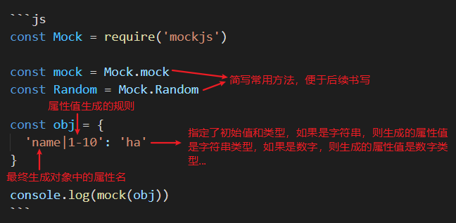

# mockjs

[mockjs github](https://github.com/nuysoft/Mock/wiki/Getting-Started)

[mockjs examples](http://mockjs.com/examples.html)

[Mock.mock()](https://www.jianshu.com/p/742da49cad3c)

安装：`npm install mockjs -D`

## 1 Mock.mock

### 1.1 使用数据模板

数据模板

```
// 属性名   name
// 生成规则 rule
// 属性值   value
'name|rule': value
```

注意：

- 属性名 和 生成规则 之间用竖线 | 分隔。
- 生成规则 是可选的。
- 生成规则 有 7 种格式：
  - 'name|min-max': value
  - 'name|count': value
  - 'name|min-max.dmin-dmax': value
  - 'name|min-max.dcount': value
  - 'name|count.dmin-dmax': value
  - 'name|count.dcount': value
  - 'name|+step': value
- 生成规则 的 含义 需要依赖 属性值的类型 才能确定。
- 属性值 中可以含有 @占位符。
- 属性值 还指定了最终值的初始值和类型。



index.js

```js
const Mock = require('mockjs')

const mock = Mock.mock

const obj = {
  'name|1-10': 'ha'
}

console.log(mock(obj))
```

在命令行执行`node index.js`，在控制台上打印出相应的结果，如 { name: 'haha' }

### 1.2 使用占位符

占位符 引用的是 Mock.Random 中的方法

index.js

```js
const Mock = require('mockjs')

const mock = Mock.mock

const obj = {
  first: '@first'
}

console.log(mock(obj))
```

在命令行执行node index.js，在控制台上打印出相应的结果，如 { name: 'Barbara' }

## 2 Mock.Random

Mock.Random 可以理解成对 Mock.mock 的进一步简化，对一些常用类型的数据进行封装。很明显，Mock.Random 比上面的数据模板使用方式要简单直接点，推荐使用这种方式。

Mock.Random 是一个工具类，用于生成各种随机数据。Mock.Random 的方法在数据模板中称为『占位符』，书写格式为 @占位符(参数 [, 参数]) 。

Mock.Random 只是用于生成随机数据，而数据的最终生成还是得借助 Mock.mock。

index.js

```js
const Mock = require('mockjs')

const mock = Mock.mock
const Random = Mock.Random

const obj = {
  first: '@first',
  last: Random.last()
}

console.log(mock(obj))
```

在命令行执行node index.js，在控制台上打印出相应的结果，如 { first: 'David', last: 'Williams' }

Type | Method
:-- | :--
Basic	| boolean, natural, integer, float, character, string, range, date, time, datetime, now
Image	| image, dataImage
Color	| color
Text	| paragraph, sentence, word, title, cparagraph, csentence, cword, ctitle
Name	| first, last, name, cfirst, clast, cname
Web	| url, domain, email, ip, tld
Address	| area, region
Helper	| capitalize, upper, lower, pick, shuffle
Miscellaneous	| guid, id