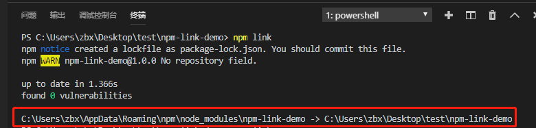
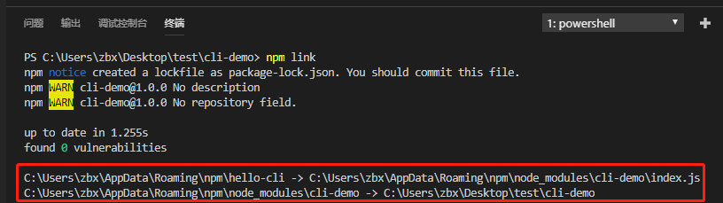

# 编写cli命令行

[npm link的使用](https://www.jianshu.com/p/aaa7db89a5b2)
[手把手教你使用nodejs编写cli(命令行)](https://www.jianshu.com/p/095c968d406f)

在正文之前先讲讲`npm link`

使用NodeJS编写的东西，要么是一个包，要么是一个命令行程序，`npm link`命令可以将一个任意位置的npm包链接到全局执行环境，从而在任意位置使用命令行都可以直接运行该npm包。

- 为npm包目录创建软链接，将其链接到目录`C:\Users\{Username}\AppData\Roaming\npm\node_modules\<package>`
- 为可执行文件(bin)创建软链接，除了上述外，还能将其链接到文件`C:\Users\{Username}\AppData\Roaming\npm\<name>`

执行`npm config get prefix`可以得到`C:\Users\{Username}\AppData\Roaming\npm`

## 对一个包执行npm link

如新建一个npm-link-demo项目，其中index.js文件内容如下

```js
module.exports = 'test npm link'
```

若要执行这个js文件，必须在命令行或者git bash中进入项目根目录然后执行`node ./index.js`，执行`npm link`可将项目npm-link-demo链接到`C:\Users\zbx\AppData\Roaming\npm\node_modules\npm-link-demo`


现在在其他项目中执行`npm link npm-link-demo`，然后就可以在该项目index.js下引入npm-link-demo，如下。这里可以把`npm link npm-link-demo`的作用理解为`npm i npm-link-demo -S`

```js
const link = require('npm-link-demo')
console.log(link)
```

## 对一个命令行程序执行npm link

1 新建项目cli-demo，其中index.js内容如下

```js
// index.js
#!/usr/bin/env node
console.log('hello world')
```

现在想在命令行中执行`hello-cli`，等价于在项目cli-demo下执行`node ./index.js`

package.json里面，添加一个bin字段：

```json
{
  "bin": {
    "hello-cli": "index.js"
  }
}
```

执行`npm link`


现在在任意位置打开命令行或者git bash，执行`hello-cli`，会输出"hello world"
