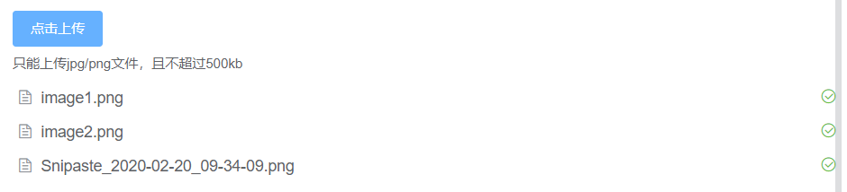
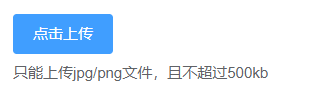
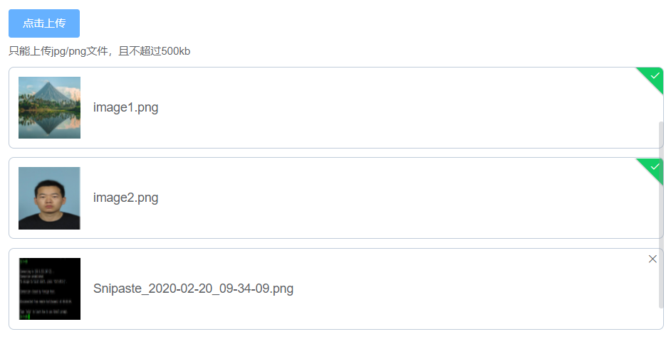
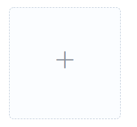
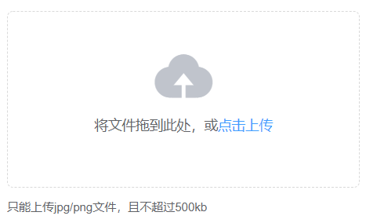
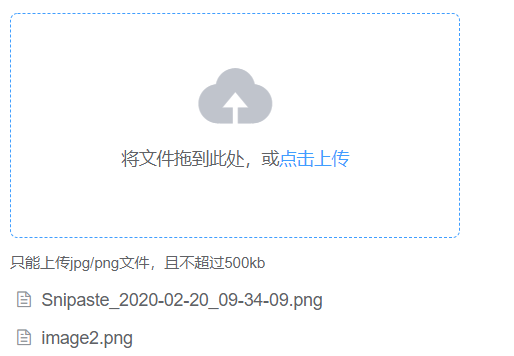
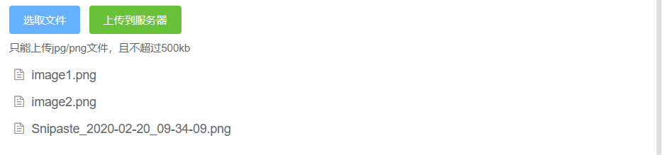
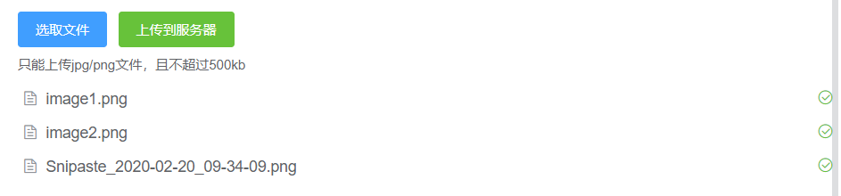

# 上传 el-upload

上传文件，这里的文件既包括图片，也包括其他文件，如word、excel、pdf等。

下面通过上传组件的一些常用属性、方法来认识 el-upload。

## 1 属性 list-type

用于定义文件列表的类型。

可选值：text/picture/picture-card
默认值：text

list-type 的每个值都对应一个 el-upload 默认样式，如果仅使用默认样式，可以不用再添加样式。

### 1.1 text

```HTML
<template>
  <el-upload
    action="/upload"
    multiple
  >
    <el-button size="small" type="primary">点击上传</el-button>
    <div slot="tip" class="el-upload__tip">只能上传jpg/png文件，且不超过500kb</div>
  </el-upload>
</template>
```

初始状态：


选择文件并上传（一步完成）：



### 1.2 picture

```html
<template>
  <el-upload
    action="/upload"
    list-type="picture"
    multiple
  >
    <el-button size="small" type="primary">点击上传</el-button>
    <div slot="tip" class="el-upload__tip">只能上传jpg/png文件，且不超过500kb</div>
  </el-upload>
</template>
```

初始状态：



选择文件并上传（一步完成）：



### 1.3 picture-card

```html
<template>
  <div>
    <el-upload
      action="/upload"
      list-type="picture-card"
      :on-preview="handlePictureCardPreview"
     >
      <i class="el-icon-plus"></i>
    </el-upload>
    <el-dialog :visible.sync="dialogVisible">
      
    </el-dialog>
  </div>
</template>

<script>
export default {
  name: 'ImageWall',
  data () {
    return {
      dialogImageUrl: '',
      dialogVisible: false
    }
  },
  methods: {
    handlePictureCardPreview (file) {
      this.dialogImageUrl = file.url
      this.dialogVisible = true
    }
  }
}
</script>
```

初始状态：



选择文件并上传（一步完成）：


默认带有删除功能，图片预览功能需要自己实现。

## 2 属性 drag

拖动上传

```html
<template>
  <el-upload
    drag
    action="/upload"
    multiple
  >
    <i class="el-icon-upload"></i>
    <div class="el-upload__text">将文件拖到此处，或<em>点击上传</em></div>
    <div class="el-upload__tip" slot="tip">只能上传jpg/png文件，且不超过500kb</div>
  </el-upload>
</template>
```

初始状态：





## 3 属性 file-list

用于初始化文件列表，如在修改用户信息，需要**回显**用户信息表单，此时就可以使用 file-list 回显用户图像。

是一个对象数组，如

```js
[
  {
    name: 'image1.png',
    url: 'http://localhost/file/image1.png'
  },
  {
    name: 'image2.png',
    url: 'http://localhost/file/image2.png'
  }
]
```

## 4 属性 limit

只有文件上传成功后，文件信息（文件名称）才会被添加到文件列表中。

有一个用户图像上传页面，最多只能上传3张图片。当用户第一次进入该页面时，页面只有一个点击上传文件按钮。用户一次性选择3张图片上传（默认选择文件后立即进行上传）（需要调用**上传接口**），上传成功，文件列表会显示有3个文件。此时再选择文件上传，并不会调用上传接口，因为用户已经上传了3张图片。

如果想要再上传图片，必须先删除一些之前的图片（需要调用**删除接口**），然后再上传图片。

当用户之后进入该页面，需要调用获取**文件列表接口**，进行文件回显。

如果第一进入页面时上传了2张图片，第二次进入页面，调用获取**文件列表接口**进行回显，通过 file-list 知道之前已经上传了2张图片，所以此次只能上传1张图片。

## 5 属性 headers

调用请求接口一般是不经过封装的 axios，那么后台是如何验证接口调用的合法性呢？可以通过 headers 将token 携带到后台来验证。

## 6 属性auto-upload、方法 submit

选择完文件后默认立即调用接口将文件上传到服务器。通过组件的 submit 方法可以将选择文件和上传动作分开。

```html
<template>
  <el-upload
    ref="upload"
    action="/upload"
    multiple
    :auto-upload="false"
  >
    <el-button slot="trigger" size="small" type="primary">选取文件</el-button>
    <el-button style="margin-left: 10px;" size="small" type="success" @click="submitUpload">上传到服务器</el-button>
    <div slot="tip" class="el-upload__tip">只能上传jpg/png文件，且不超过500kb</div>
  </el-upload>
</template>

<script>
export default {
  name: 'ManualUpload',
  methods: {
    submitUpload () {
      this.$refs.upload.submit()
    }
  }
}
</script>
```

初始状态：


选择文件：



上传到服务器：



## 7 事件属性

### 7.1 on-success

属性值类型：

`function(response, file, fileList)`

### 7.2 on-erroe

属性值类型：

`function(response, file, fileList)`

### 7.3 on-preview

属性值类型：

`function(file)`

### 7.4 on-remove

属性值类型：

`function(file, fileList)`

### 7.5 on-change

属性值类型：

`function(file, fileList)`

### 7.6 on-exceed

属性值类型：

`function(files, fileList)`

### 7.7 on-progress

属性值类型：

`function(event, file, fileList)`


