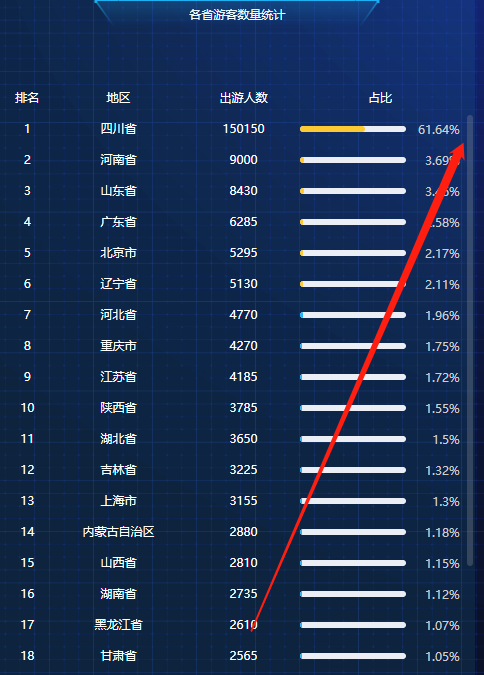

# 滚动条组件el-scrollbar

element-ui 官网并没有介绍滚动条组件 el-scrollbar 的用法，但在实际项目中是可以使用该组件的。



```html
<template>
  <div style="height:600px;" class="hello">
    <el-scrollbar style="height:100%">
        <div style="width:700px;height:700px;border:solid;" >
          ....... blabla.....
        </div>
    </el-scrollbar>
  </div>
</template>

<style scope lang="less">
.hello ::v-deep .el-scrollbar__wrap{ 
  overflow-x: hidden;
}
</style>
```

在使用时要设置外层容器高度。并且要设置el-scrollbar 的高度为100%