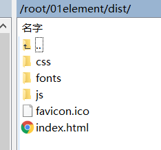

# 01简单部署

路由使用的是hash模式

路由文件 index.js：

```js
import Vue from 'vue'
import VueRouter from 'vue-router'
import { menu, getRoutes } from '@/assets/js/menu'

Vue.use(VueRouter)

const routes = getRoutes(menu)

const router = new VueRouter({
  mode: 'history',
  routes
})

export default router
```

静态资源：



nginx 配置 nginx.conf:

```conf
server {
    listen       80 default_server;
    listen       [::]:80 default_server;
    server_name  _;
    root         /root/01element/dist;

    # Load configuration files for the default server block.
    include /etc/nginx/default.d/*.conf;

    location / {
      try_files $uri $uri/ /index.html;
    }
}
```

在浏览器中进入`http://49.234.187.153/basic/layout`