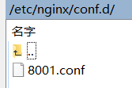

# 03部署到不同端口

[Nginx 不同端口配置多个项目](https://blog.csdn.net/shenxianhui1995/article/details/103870923)

## 方式一

配置也可以写在主配置文件nginx.conf中，这里写在子配置文件中。



8001.conf

```conf
server{
    listen 8001;
    server_name localhost;
    root /root/01element/dist;
    index index.html;
}
```

在浏览器中进入`http://49.234.187.153:8001/#/basic/layout`

## 方式二

配置直接写在主配置文件nginx.conf中。

```conf
http {
    log_format  main  '$remote_addr - $remote_user [$time_local] "$request" '
                      '$status $body_bytes_sent "$http_referer" '
                      '"$http_user_agent" "$http_x_forwarded_for"';

    access_log  /var/log/nginx/access.log  main;

    sendfile            on;
    tcp_nopush          on;
    tcp_nodelay         on;
    keepalive_timeout   65;
    types_hash_max_size 2048;

    include             /etc/nginx/mime.types;
    default_type        application/octet-stream;

    # Load modular configuration files from the /etc/nginx/conf.d directory.
    # See http://nginx.org/en/docs/ngx_core_module.html#include
    # for more information.
    include /etc/nginx/conf.d/*.conf;

    server {
        listen       80 default_server;
        listen       [::]:80 default_server;
        server_name  _;
        # root         /usr/share/nginx/html;
        root         /root/01element/dist;

        # Load configuration files for the default server block.
        include /etc/nginx/default.d/*.conf;

        location / {
          try_files $uri $uri/ /index.html;
        }

        location /new {
          alias /root/01element/dist-new/;
          try_files $uri $uri/ /new/index.html;
        }

        error_page 404 /404.html;
            location = /40x.html {
        }

        error_page 500 502 503 504 /50x.html;
            location = /50x.html {
        }
    }

    # 新增一个server
    server {
      listen 8006;
      location / {
        root /root/01element/dist-hash;
      }
    }
# Settings for a TLS enabled server.

    # server {
    #     listen       443 ssl http2 default_server;
    #     listen       [::]:443 ssl http2 default_server;
    #     server_name  _;
    #     root         /usr/share/nginx/html;

    #     ssl_certificate "/etc/nginx/1_www.itboy.site_bundle.crt";
    #     ssl_certificate_key "/etc/nginx/2_www.itboy.site.key";
    #     ssl_session_cache shared:SSL:1m;
    #     ssl_session_timeout  10m;
    #     ssl_ciphers HIGH:!aNULL:!MD5;
    #     ssl_prefer_server_ciphers on;

    #     # Load configuration files for the default server block.
    #     include /etc/nginx/default.d/*.conf;

    #     location / {
    #     }

    #     error_page 404 /404.html;
    #         location = /40x.html {
    #     }

    #     error_page 500 502 503 504 /50x.html;
    #         location = /50x.html {
    #     }
    # }

}
```

在浏览器中进入`http://49.234.187.153:8006/#/basic/layout`