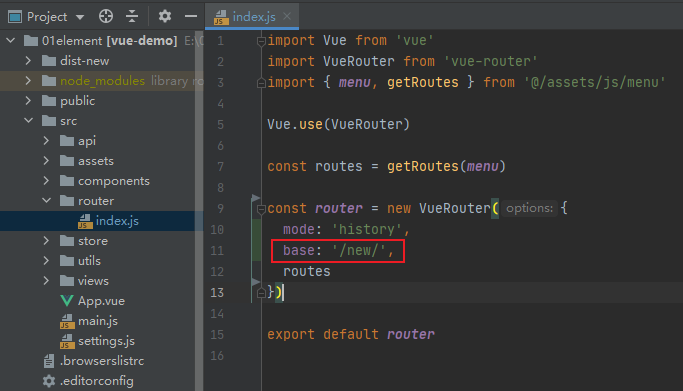
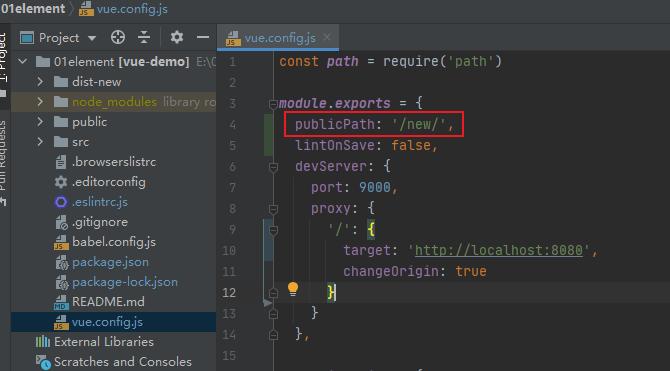

# 04部署到一个子路径上

[如何在NGINX中部署多个前端项目](https://blog.csdn.net/kielin/article/details/94459660)





```conf
server {
    listen       80 default_server;
    listen       [::]:80 default_server;
    server_name  _;
    root         /root/01element/dist;

    # Load configuration files for the default server block.
    include /etc/nginx/default.d/*.conf;

    location / {
      try_files $uri $uri/ /index.html;
    }

    location /new {
      alias /root/01element/dist-new/;
      try_files $uri $uri/ /new/index.html;
    }
}
```

在浏览器中进入`http://49.234.187.153/new/basic/layout`