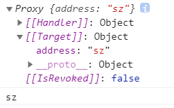
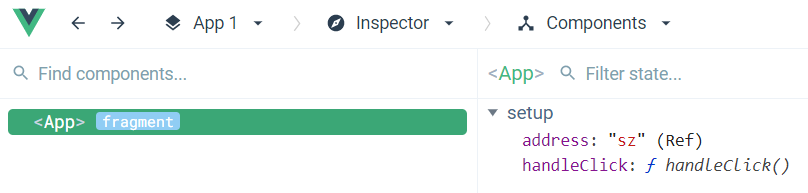
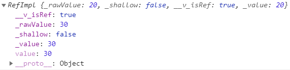
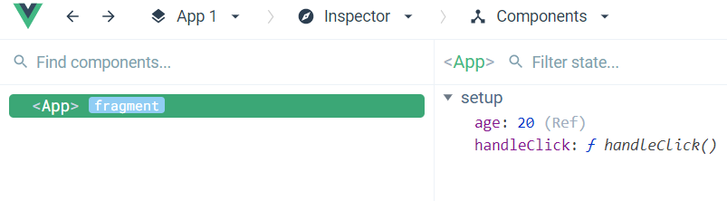
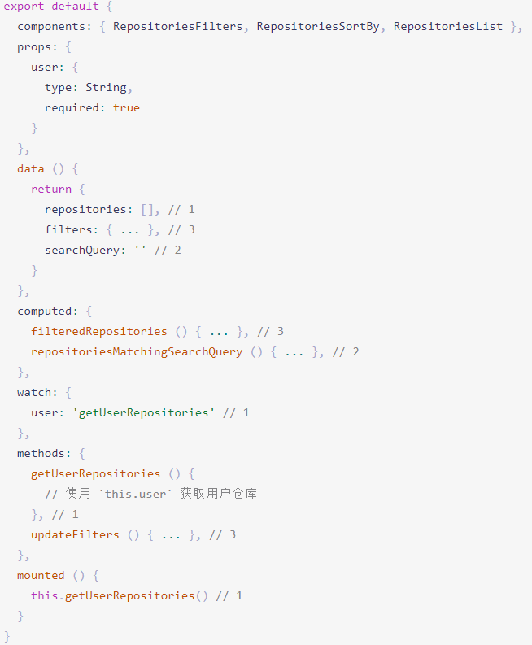

# 组合式API

[组合式API](https://vue3js.cn/docs/zh/guide/composition-api-introduction.html)

组合式 API 即 Composition API，另外还有选项式 API 即Options API

简单点理解就是在 setup 中放入data、methods、生命周期钩子函数、监听watch、计算属性computed。

从 Vue 中可以导出许多函数，如reactive、ref、watch、onMounted、computed，对于函数，要明白其作用、入参、返回值。
## reactive

[响应性基础](https://v3.cn.vuejs.org/guide/reactivity-fundamentals.html)

参数：对象
返回值：响应式对象

```html
<template>
  <button @click="handleClick">click</button>
  <p>{{address}}</p>
</template>

<script>
import { reactive, toRefs } from 'vue'

export default {
  setup() {
    const state = reactive({
      address: 'sz'
    })

    const handleClick = () =>{
      console.log(state)
      console.log(state.address)
    }

    return {
      ...toRefs(state),
      handleClick
    }
  }
}
</script>
```

浏览器控制台：



Vue Devtools:



在 js 中访问和修改 address 都是通过 state.address 形式，在模板中可以直接使用 address。

在js文件中操作ref对象创建的值需要使用 .value 在模板中则可以直接使用，因为在模板中会自动添加。value

一般使用 reactive，而少使用 ref


## ref

参数：基本类型值，如字符串、数字
返回值：独立的响应式值

[响应性基础](https://v3.cn.vuejs.org/guide/reactivity-fundamentals.html)

```html
<template>
  <button @click="handleClick">click</button>
  <p>{{msg}}</p>
</template>

<script>
import { ref } from 'vue'

export default {
  setup() {
    const age = ref(20)

    const handleClick = () =>{
      console.log(age)
      age.value = 30
    }

    return {
      age,
      handleClick
    }
  }
}
</script>
```

浏览器控制台：



Vue Devtools:



在 js 中访问和修改 age 都要通过 value，在模板中可以直接使用 age。

ref 将一个简单的基本类型值转换为一个对象，其内部应该使用 reactive


## props

通过 `props.name` 使用 props，或者 

```js
const { name } = toRefs(props)

console.log(name.value)
```


组合式 API 不是用来替代选项式 API，它的出现是为了解决选项式 API中存在的缺点，它很好的解决了逻辑关注点分离的问题，接用管网中的示例代码



其中标1的内容属于同一逻辑关注点，但是其分布在不同的 Vue 选项中，如果组件代码量很多，不管是理解代码，还是查找代码都是比较费劲的。

用组件的选项 (data、computed、methods、watch) 组织逻辑在大多数情况下都有效。然而，当我们的组件变得更大时，逻辑关注点的列表也会增长。这可能会导致组件难以阅读和理解。

## watch

watch 函数接受三个参数：
- 监听的数据源，可以是返回一个值的 getter 函数，或者直接是一个ref
  ```js
  // watching a getter
  const state = reactive({ count: 0 })
  watch(() => state.count, (count, prevCount) => {
    /* ... */
  })

  // directly watching a ref
  const count = ref(0)
  watch(count, (count, prevCount) => {
    /* ... */
  })
  ```
- 一个回调
- 可选的配置项，是一个对象，包含两个属性immediate、deep

computed

onMounted
