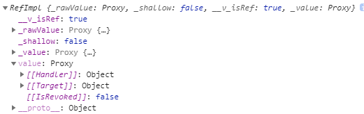
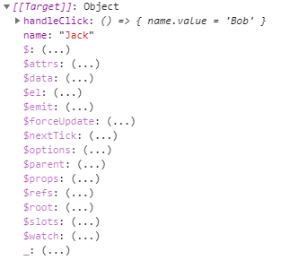
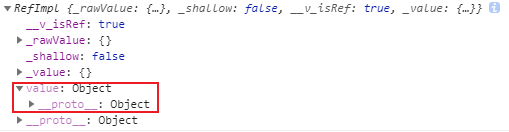
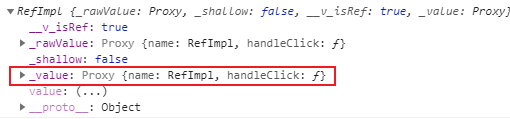

# 组合式API语法糖

组合式API语法糖的出现只是为了简化代码，确实，同样的功能，语法糖写法比常规写法代码量少很多，代码逻辑也显得更简洁明了。以前template中是视图层，setup方法中是逻辑层，setup返回值是视图层和逻辑层的连结，语法糖写法模糊了这种连结。

## 1 引入的新方法

语法糖语法引入了几个新的方法：

- defineProps：用于定义组件的prop，相当于选项式API中的props
- defineEmit：用于定义组件的emit，相当于选项式API中的emit
- useContext: 类似组合式API中setup方法第二个参数context，用于获取props、执行emit等

```html
<template>
  <h1>{{name}}</h1>
  <button @click="handleClick">click</button>
</template>

<script setup>
import { defineProps, defineEmit, onMounted } from 'vue'

const props = defineProps({
  name: String
})
const emit = defineEmit(['say'])

onMounted(() => {
  console.log(props.name)
})

const handleClick = () => {
  emit('say', 'hello')
}
</script>
```

```html
<template>
  <h1>{{name}}</h1>
  <button @click="handleClick">click</button>
</template>

<script setup>
import { defineProps, defineEmit, onMounted, useContext } from 'vue'

defineProps({
  name: String
})
defineEmit(['say'])

const { props, emit } = useContext()

onMounted(() => {
  console.log(props.name)
})

const handleClick = () => {
  emit('say', 'hello')
}
</script>
```

想在script标签内使用props （即组合式API中setup方法参数，如下），有两种方式：

- 方式一：使用调用defineProps后的返回值
- 方式二：通过调用useContext，并获取props

推荐方式二，让defineProps仅用于定义props，当script标签内需要使用props时，再调用useContext。emit类似。

```html
<script>
import { onMounted } from 'vue'
export default {
  props: {
    name: String
  },
  emits: ['say'],
  setup (props, { emit }) {
    onMounted(() => {
      console.log(props.name)
    })

    const handleClick = () => {
      emit('say', 'hello')
    }

    return {
      handleClick
    }
  }
}
</script>
```

## 2 inheritAttrs放到template上

```html
<template inherit-attrs="false">
  <h1>{{name}}</h1>
</template>

<script setup>
  import { ref } from 'vue'
  const name = ref('Jack')
</script>
```

## 3 数据不再默认挂载到组件实例上

之前会把setup返回的对象挂载到组件的实例上，而现在不会

App.vue

```html
<template>
  <HelloWorld ref="helloRef"/>
</template>

<script setup>
import { ref, onMounted } from 'vue'
import HelloWorld from './components/HelloWorld.vue'

const handleTest = (value) => {
  console.log(value)
}
const helloRef = ref(null)
onMounted(() => {
  console.log(helloRef)
})
</script>
```

之前：HelloWorld.vue

```html
<template>
  <h1>{{name}}</h1>
  <button @click="handleClick">click</button>
</template>

<script setup>
  import { ref } from 'vue'
  export default {
    setup() {
      const name = ref('Jack')
      const handleClick = () => {
        name.value = 'Bob'
      }
      return {
        name,
        handleClick
      }
    }
  }
</script>
```





现在：HelloWorld.vue

```html
<template>
  <h1>{{name}}</h1>
  <button @click="handleClick">click</button>
</template>

<script setup>
  import { ref } from 'vue'
  const name = ref('Jack')
  const handleClick = () => {
    name.value = 'Bob'
  }
</script>
```



如果需要给组件实例添加属性、方法，可以通过useContext().expose方法明确定义：

```html
<template>
  <h1>{{name}}</h1>
  <button @click="handleClick">click</button>
</template>

<script setup>
  import { ref, useContext } from 'vue'
  const name = ref('Jack')
  const handleClick = () => {
    name.value = 'Bob'
  }
  const { expose } = useContext()
  expose({
    name,
    handleClick
  })
</script>
```

