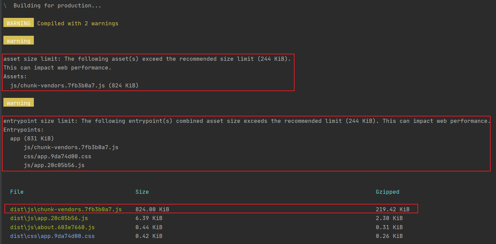
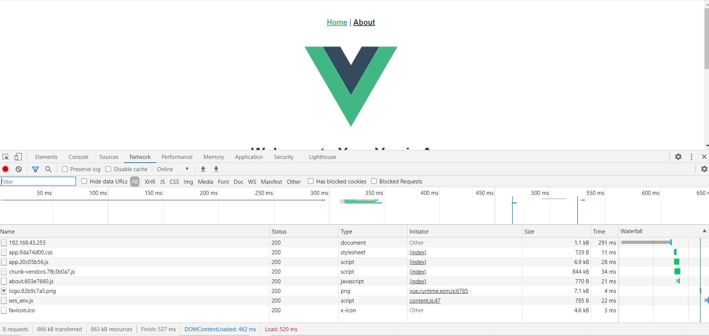
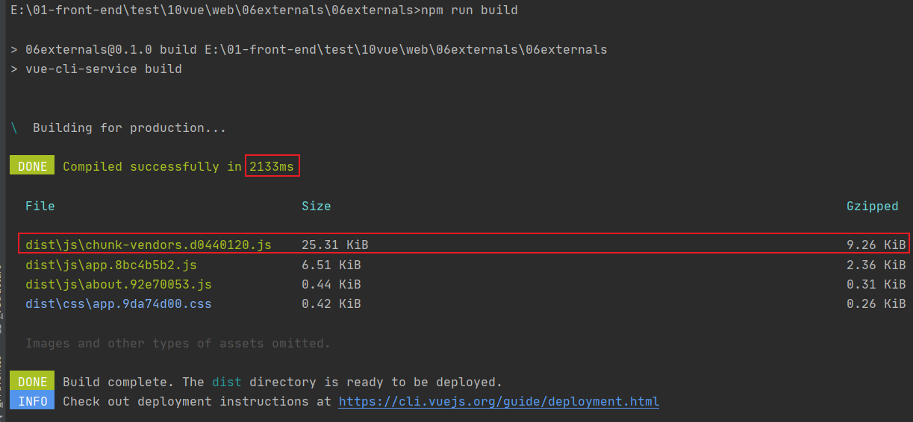
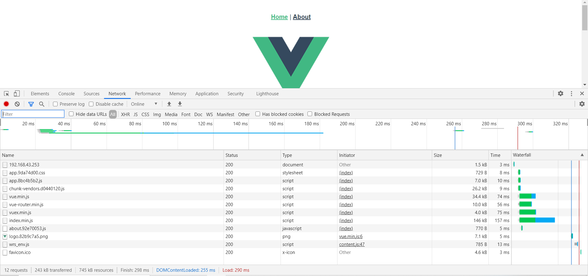

# 外部扩展externals

[externals](https://webpack.docschina.org/configuration/externals/#externals)

1. 修改webpack配置
  key 和 value 一定要写对，externals中的key是后面需要require的名字，value是第三方库暴露出来的方法名。

2. 通过 `<script></script>` 加载资源
  一般是CDN，也可以将资源放入一个静态服务器再引入。

注意无需注释代码中相关的import，例如 main.js 中的`import Vue from 'vue'`，可有可无，注释了项目也可以运行，建议不注释，原因有一下几点：

- 尽量少改动原代码
- 保留import有利于代码理解，当在代码中遇到相关变量时，可以帮忙明白其功能含义
- 注释了可能引起 Eslint 保存、告警

## 案例分析

### 第一种情况，完全不使用externals配置

main.js

```js
import Vue from 'vue'
import App from './App.vue'
import router from './router'
import store from './store'
import ElementUI from 'element-ui'

Vue.config.productionTip = false

Vue.use(ElementUI)

new Vue({
  router,
  store,
  render: h => h(App)
}).$mount('#app')

```





### 第二种情况，使用externals配置，将一些不常修改的大包作为外部扩展。

vue.config.js

```js
module.exports = {
  configureWebpack: {
    externals: {
      vue: 'Vue',
      'vue-router': 'VueRouter',
      vuex: 'Vuex',
      'element-ui': 'ELEMENT'
    }
  }
}
```

index.html

```html
<!DOCTYPE html>
<html lang="en">
  <head>
    <meta charset="utf-8">
    <meta http-equiv="X-UA-Compatible" content="IE=edge">
    <meta name="viewport" content="width=device-width,initial-scale=1.0">
    <link rel="icon" href="<%= BASE_URL %>favicon.ico">
    <title><%= htmlWebpackPlugin.options.title %></title>
  </head>
  <body>
    <noscript>
      <strong>We're sorry but <%= htmlWebpackPlugin.options.title %> doesn't work properly without JavaScript enabled. Please enable it to continue.</strong>
    </noscript>
    <div id="app"></div>
    <!-- built files will be auto injected -->
    <script src="https://cdn.bootcdn.net/ajax/libs/vue/2.6.12/vue.min.js"></script>
    <script src="https://cdn.bootcdn.net/ajax/libs/vue-router/3.4.8/vue-router.min.js"></script>
    <script src="https://cdn.bootcdn.net/ajax/libs/vuex/3.5.1/vuex.min.js"></script>
    <script src="https://cdn.bootcdn.net/ajax/libs/element-ui/2.14.0/index.min.js"></script>
  </body>
</html>
```





比较

 比较项目 |不使用externals | 使用externals | 结论
:-- | :-- | :-- | :--
打包时间 | 应该大于2133ms | 2133ms | 打包时间缩短，打包更快
打包之后包的大小 | 压缩后219.42KB | 压缩后9.26KB | 打包后生成的文件体积更小
浏览器加载 | 8个请求，用时520ms | 12个请求，用时290ms | 

由于externals属性，是将依赖排除，本该将node_modules中依赖包打入到vendor bundle中，改成通过CDN引入