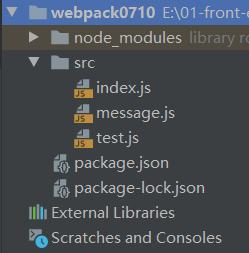

# 打包结果 bundle 分析

为了得到一个简单的 bundle，这里写个小 demo



```js
// index.js
import a from './test'
console.log(a)

// test.js
import b from './message'
const a = 'hello' + b
export default a

// message.js
const b = 'world'
export default b
```

在控制台执行 `npx webpack --mode=development`，会在项目根目录下生成 dist 目录，目录下有文件 main.js，内容如下：

```js
/******/ (function(modules) { // webpackBootstrap
/******/ 	// The module cache
/******/ 	var installedModules = {};
/******/
/******/ 	// The require function
/******/ 	function __webpack_require__(moduleId) {
/******/
/******/ 		// Check if module is in cache
/******/ 		if(installedModules[moduleId]) {
/******/ 			return installedModules[moduleId].exports;
/******/ 		}
/******/ 		// Create a new module (and put it into the cache)
/******/ 		var module = installedModules[moduleId] = {
/******/ 			i: moduleId,
/******/ 			l: false,
/******/ 			exports: {}
/******/ 		};
/******/
/******/ 		// Execute the module function
/******/ 		modules[moduleId].call(module.exports, module, module.exports, __webpack_require__);
/******/
/******/ 		// Flag the module as loaded
/******/ 		module.l = true;
/******/
/******/ 		// Return the exports of the module
/******/ 		return module.exports;
/******/ 	}
/******/
/******/
/******/ 	// expose the modules object (__webpack_modules__)
/******/ 	__webpack_require__.m = modules;
/******/
/******/ 	// expose the module cache
/******/ 	__webpack_require__.c = installedModules;
/******/
/******/ 	// define getter function for harmony exports
/******/ 	__webpack_require__.d = function(exports, name, getter) {
/******/ 		if(!__webpack_require__.o(exports, name)) {
/******/ 			Object.defineProperty(exports, name, { enumerable: true, get: getter });
/******/ 		}
/******/ 	};
/******/
/******/ 	// define __esModule on exports
/******/ 	__webpack_require__.r = function(exports) {
/******/ 		if(typeof Symbol !== 'undefined' && Symbol.toStringTag) {
/******/ 			Object.defineProperty(exports, Symbol.toStringTag, { value: 'Module' });
/******/ 		}
/******/ 		Object.defineProperty(exports, '__esModule', { value: true });
/******/ 	};
/******/
/******/ 	// create a fake namespace object
/******/ 	// mode & 1: value is a module id, require it
/******/ 	// mode & 2: merge all properties of value into the ns
/******/ 	// mode & 4: return value when already ns object
/******/ 	// mode & 8|1: behave like require
/******/ 	__webpack_require__.t = function(value, mode) {
/******/ 		if(mode & 1) value = __webpack_require__(value);
/******/ 		if(mode & 8) return value;
/******/ 		if((mode & 4) && typeof value === 'object' && value && value.__esModule) return value;
/******/ 		var ns = Object.create(null);
/******/ 		__webpack_require__.r(ns);
/******/ 		Object.defineProperty(ns, 'default', { enumerable: true, value: value });
/******/ 		if(mode & 2 && typeof value != 'string') for(var key in value) __webpack_require__.d(ns, key, function(key) { return value[key]; }.bind(null, key));
/******/ 		return ns;
/******/ 	};
/******/
/******/ 	// getDefaultExport function for compatibility with non-harmony modules
/******/ 	__webpack_require__.n = function(module) {
/******/ 		var getter = module && module.__esModule ?
/******/ 			function getDefault() { return module['default']; } :
/******/ 			function getModuleExports() { return module; };
/******/ 		__webpack_require__.d(getter, 'a', getter);
/******/ 		return getter;
/******/ 	};
/******/
/******/ 	// Object.prototype.hasOwnProperty.call
/******/ 	__webpack_require__.o = function(object, property) { return Object.prototype.hasOwnProperty.call(object, property); };
/******/
/******/ 	// __webpack_public_path__
/******/ 	__webpack_require__.p = "";
/******/
/******/
/******/ 	// Load entry module and return exports
/******/ 	return __webpack_require__(__webpack_require__.s = "./src/index.js");
/******/ })
/************************************************************************/
/******/ ({

/***/ "./src/index.js":
/*!**********************!*\
  !*** ./src/index.js ***!
  \**********************/
/*! no exports provided */
/***/ (function(module, __webpack_exports__, __webpack_require__) {

"use strict";
eval("__webpack_require__.r(__webpack_exports__);\n/* harmony import */ var _test__WEBPACK_IMPORTED_MODULE_0__ = __webpack_require__(/*! ./test */ \"./src/test.js\");\n\r\nconsole.log(_test__WEBPACK_IMPORTED_MODULE_0__[\"default\"])\r\n\n\n//# sourceURL=webpack:///./src/index.js?");

/***/ }),

/***/ "./src/message.js":
/*!************************!*\
  !*** ./src/message.js ***!
  \************************/
/*! exports provided: default */
/***/ (function(module, __webpack_exports__, __webpack_require__) {

"use strict";
eval("__webpack_require__.r(__webpack_exports__);\nconst b = 'wrold'\r\n/* harmony default export */ __webpack_exports__[\"default\"] = (b);\r\n\n\n//# sourceURL=webpack:///./src/message.js?");

/***/ }),

/***/ "./src/test.js":
/*!*********************!*\
  !*** ./src/test.js ***!
  \*********************/
/*! exports provided: default */
/***/ (function(module, __webpack_exports__, __webpack_require__) {

"use strict";
eval("__webpack_require__.r(__webpack_exports__);\n/* harmony import */ var _message__WEBPACK_IMPORTED_MODULE_0__ = __webpack_require__(/*! ./message */ \"./src/message.js\");\n\r\n\r\nconst a = 'hello' + _message__WEBPACK_IMPORTED_MODULE_0__[\"default\"]\r\n\r\n/* harmony default export */ __webpack_exports__[\"default\"] = (a);\r\n\r\n\r\n\r\n\r\n\n\n//# sourceURL=webpack:///./src/test.js?");

/***/ })

/******/ });

```

这个文件可以在浏览器环境中执行，在 dist 目录添加 index.html:

```html
<!DOCTYPE html>
<html lang="en">
<head>
    <meta charset="UTF-8">
    <title>Title</title>
</head>
<body>
    <script src="main.js"></script>
</body>
</html>
```

然后再浏览器中打开 index.html，控制台输出 helloworld。

bundle 看着很长，其实是一个自执行函数，结构如下：

```js
(function (modules) {
  var installedModules = {};

  function __webpack_require__(moduleId) {
    
  }

  return __webpack_require__(__webpack_require__.s = "./src/index.js");
})({
  "./src/index.js": (function (module, __webpack_exports__, __webpack_require__) {
    // ...
  }),
  "./src/message.js": (function (module, __webpack_exports__, __webpack_require__) {
    // ...
  }),
  "./src/test.js": (function (module, __webpack_exports__, __webpack_require__) {
    // ...
  })
})
```

自执行函数的参数是一个对象，该对象的 key 是模块id（模块路径），value 是一个函数。函数内部是我们定义的文件转移成 ES5 之后的代码，通过eval来执行。对 eval 内容进行格式化，得到

./src/index.js

```js
function (module, __webpack_exports__, __webpack_require__) {
  __webpack_require__.r(__webpack_exports__);
  var _test__WEBPACK_IMPORTED_MODULE_0__ = __webpack_require__("./src/test.js");

  console.log(_test__WEBPACK_IMPORTED_MODULE_0__["default"])
}
```

./src/test.js

```js
function (module, __webpack_exports__, __webpack_require__) {
  __webpack_require__.r(__webpack_exports__);
  var _message__WEBPACK_IMPORTED_MODULE_0__ = __webpack_require__("./src/message.js");

  const a = 'hello' + _message__WEBPACK_IMPORTED_MODULE_0__["default"]

  __webpack_exports__["default"] = (a);
}
```

./src/message.js

```js
function (module, __webpack_exports__, __webpack_require__) {
  __webpack_require__.r(__webpack_exports__);
  const b = 'wrold'
  __webpack_exports__["default"] = (b);
}
```


自执行函数中定义了一个变量 installedModules 和 函数 `__webpack_require__`，

## 变量 installedModules

是一个对象，执行`__webpack_require__`函数会逐渐填充对象，对象的 key 是模块id（即模块路径），value 是一个对象，记录了该模块的关键信息，表示该模块。

```js
{
  
  './src/message.js': {
    i: './src/message.js', // moduleId
    l: true, // 是否已经缓存
    // 模块对外暴露的属性
    exports: {
      default: 'world'
    }
  },
  './src/test.js': {
    i: './src/test.js',
    l: true,
    exports: {
      default: 'hellowrold'
    }
  },
  './src/index.js': {
    i: './src/index.js',
    l: true,
    exports: {}
  }
}
```

变量在函数 `__webpack_require__`中被用到。

## 函数 `__webpack_require__`

函数的入参是模块id，返回一个由该模块对外暴露的属性及属性值组成对象。函数的另一个作用是对变量 installedModules 进行赋值填充。函数的作用可以概况为用于导入模块，并返回被导入模块的所有输出（export）

在自执行函数中，函数 `__webpack_require__`调用的入口：

```js
return __webpack_require__(__webpack_require__.s = "./src/index.js");
```

函数 `__webpack_require__` 内部：

```js
modules[moduleId].call(module.exports, module, module.exports, __webpack_require__);
```

这里调用了我们modules中的函数，传入的三个函数分别是

- module : installedModules[moduleId]，表示该模块
- module.exports： installedModules[moduleId]['exports']，表示该模块暴露的exports
- `__webpack_require__`：`__webpack_require__` 函数
