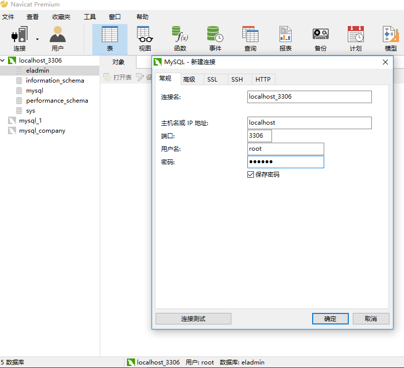
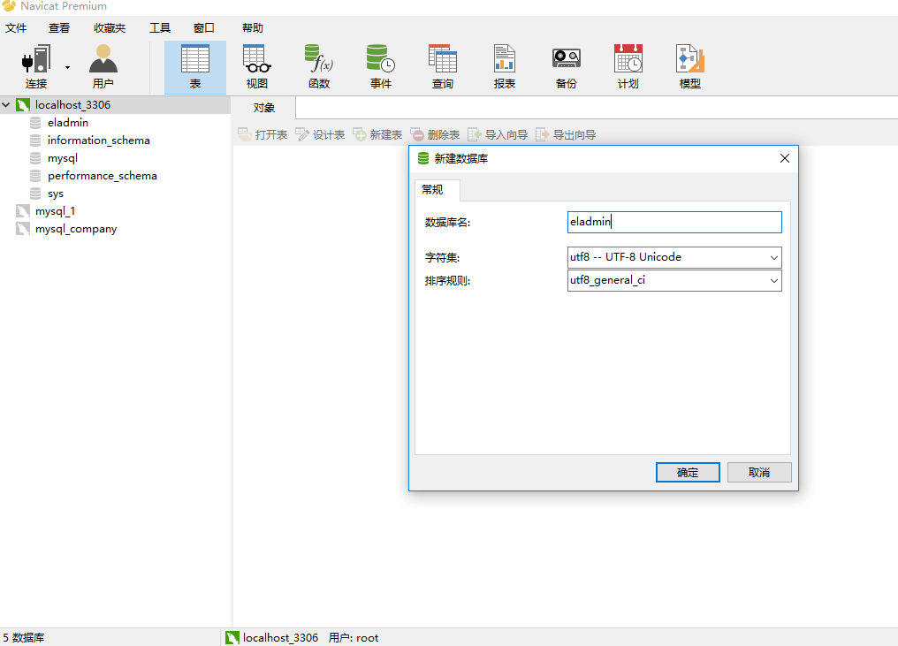
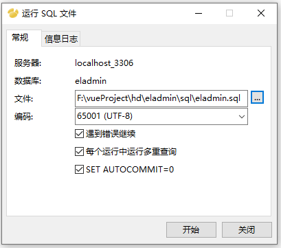

# navicat

## 1 新建连接

安装navicat并注册后，用navicat连接数据库，点击左上方连接

上图中连接“localhost_3306”已经建立，弹框内容仅为了截图演示

连接名：需要输入的是你新建的连接的的名字，这里我们就命名为“本地”。
主机名或IP地址：你需要输入的是你本机的ip地址或者直接输入“localhost”，这里我们选择第二种。
端口：输入你安装时候的端口号，一般为默认的3306。
用户名和密码：我的用户名是：root，密码：（保密，嘿嘿）。
最后把下面那个“保存密码”的小框框给勾上。

填完之后点击右下角“连接测试”按钮，如果提示“连接成功”，点击“确定”按钮

连接localhost_3306下默认有4个数据库（数据库eladmin是后期新建的）

## 2 新建数据库

在连接localhost_3306上右键-新建数据库。

## 3 导入sql文件

数据库eladmin新建成功后，通过sql文件快速导入表。

