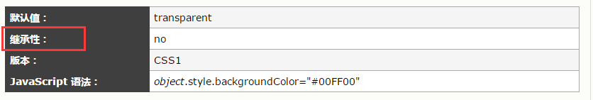

# CSS的继承性、层叠性、优先级

- [1 继承性](#1继承性)
- [2 层叠性](#2层叠性)
- [3 优先级](#3优先级)
  - [3.1 权重](#31权重)

## 1 继承性

继承性是指指被包在内部的标签将拥有外部标签的样式性，即子元素可以继承父元素的属性。在CSS中以text-、font-、line- 开头的属性都是可以继承的。但是也有以下几个特殊点：
- a 标签的字体颜色不能被继承
-	h标签字体的大下也是不能被继承的

故a、h标签在common.css文件中会被单独列出
在w3shool学习css时，在介绍每个样式的基本信息时，都有继承性的说明，反映出继承性还是很重要的。如下图：

```html
<!DOCTYPE html>
<html>
  <head>
    <title>test</title>
    <meta charset="utf-8">
    <style>
      div {color: red;}
    </style>
  </head>
  <body>
    <div>
      <p>国庆节快乐！</p> <!-- 这里，在div中设置color，他的后代元素p中的文字，都被设置为了红色，这就是继承性 -->
    </div>
  </body>
</html>
```

## 2 层叠性

当同一个元素被两个选择器选中时，CSS会根据选择器的权重决定使用哪一个选择器。权重低的选择器效果会被权重高的选择器效果覆盖（层叠）。

## 3 优先级

!important > 行内样式 > id选择器 > 类选择器 > 标签选择器 > 通配符 > 继承

### 3.1 权重

多个选择器组合以后的优先级
算法：（0，0，0，0） ==> 第一个0是!important的个数，第二个0是id选择器的个数，第三个0是类选择器的个数，第四个0是标签选择器的个数。

```css
#box .imp p {} // 权重0,1,1,1
```

```css
div.imp div.imp2 div.imp3 p {} // 权重0,0,3,4
```
0111大于0034，所以选择器`#box .imp p`权重大于`div.imp div.imp2 div.imp3 p`

当选择器的权重相同时，会选择声明在后面的选择器，类似于变量赋值。
