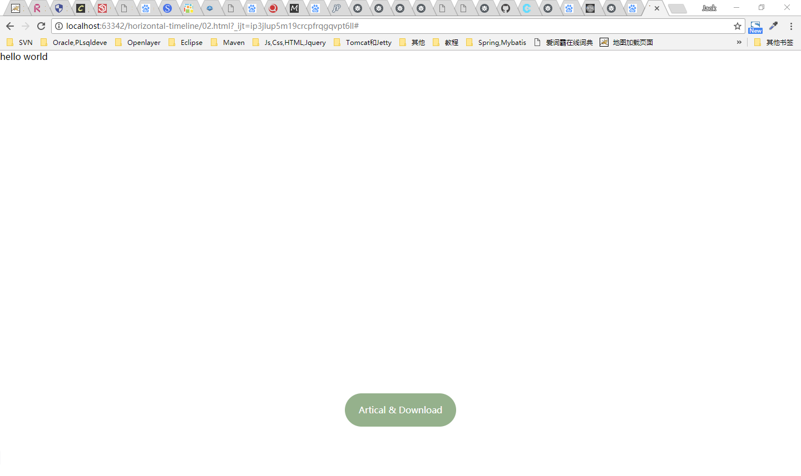

# calc()

目录

- [calc()](#calc)
  - [1 简介](#1-简介)
  - [2 用法](#2-用法)
  - [3 运算规则](#3-运算规则)
  - [4 兼容性](#4-兼容性)
  - [5 例子](#5-例子)
  - [6 注意](#6-注意)
  - [7 对scss变量做calc计算的方法](#7-对scss变量做calc计算的方法)

## 1 简介

英文单词calculate()的简写。用来指定元素的长度。比如说，你可以使用calc()给元素的border、margin、pading、font-size和width等属性设置动态值。

## 2 用法

```css
.elm {
  width: calc(expression);
}
```

## 3 运算规则

- 使用"+"，"-"，"*"，"/"四则运算。
- 可以使用百分比、px、em、rem等单位，可以混合使用各种单位。
- "+"，"-"，其前后必须有空格。
- "*"，"/"可以没有空格，但建议加上。

## 4 兼容性

浏览器对calc()的兼容性还算不错，在IE9+、FF4.0+、Chrome19+、Safari6+都得到较好支持，大家在实际使用时，同样需要添加浏览器的前缀。

```css
.elm {
  /* Firefox */
  -moz-calc(expression);
  /* chrome safari */
  -webkit-calc(expression);
  /* Standard */
  calc();
 }
```

## 5 例子

按钮

```html
<!DOCTYPE html>
<html lang="en">
<head>
  <meta charset="UTF-8">
  <title>Title</title>
  <style>
    html, body {
      margin: 0;
      padding: 0;
    }
    a {
      text-decoration: none;
      display: inline-block;
      width: 200px;
      height: 60px;
      background-color: rgba(123, 157, 111, .8);
      line-height: 60px;
      text-align: center;
      border-radius: 30px;
      color: #fff;
      position: fixed;
      bottom: 100px;
      left: calc(50% - 100px);  // 这里的%相对的是父容器
    }
    a:hover{
      background-color: rgba(123, 157, 111, 1);
    }
  </style>
</head>
<body>
  <div>hello world</div>
  <div class="container">
    <a href="#">Artical & Download</a>
  </div>
</body>
</html>
```



水平垂直居中

响应式

```html
<!DOCTYPE html>
<html lang="en">
<head>
  <meta charset="UTF-8">
  <meta name="viewport" content="width=device-width, initial-scale=1.0">
  <meta http-equiv="X-UA-Compatible" content="ie=edge">
  <title>Document</title>
  <style>
    *{
      padding: 0;
      margin: 0;
    }
    html, body{
      width: 100%;
      height: 100%;
    }
    header{
      height: 100px;
      background: red;
    }
    .contenter{
      height: calc(100% - 100px);
      background-color: green;
    }
  </style>
</head>
<body>
  <header>i am header</header>
  <div class="contenter">constent</div>
</body>
</html>
```


## 6 注意

- 在less,sass中使用时应注意，`div{width: calc(100% - 30px)}`会被解析成div{width: 70%}
解决办法：`div{width: calc(~"100% - 30px")}`

- calc内可以不止有一次运算
  `height: calc(100% - 180px - 41PX);`

## 7 对scss变量做calc计算的方法

对一个scss变量做calc处理，直接使用变量，浏览器是无法识别的，要对变量处理才能正常使用：

假定定义变量$a = '20px'，若要使用calc，直接calc(100% - $a)这么用是不行的，需要按如下使用方法：

`calc(100% - #{$a})`