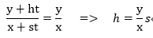
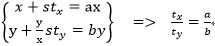

# 背景

目录

- [背景](#%E8%83%8C%E6%99%AF)
  - [1 background-size](#1-background-size)
  - [2 background-position](#2-background-position)

## 1 background-size

用于设置背景图像的尺寸，类似img元素的width和height属性。值可能是length|percentage|cover|contain。

值为length|percentage：
第一个值是设置宽度，第二是设置高度，如果只设置一个值，则第二个值会被设置为auto（如果只设置一个值，即宽度，背景图像尺寸相对原图是等比例缩放的，这一点类似img、video元素）

值为cover|contain：
相同点：背景图像都是等比例缩放
不同点：
cover：缩放背景图片，使背景图像完全覆盖背景区域，图像的某些部分可能无法在背景区域中显示出来
contain：缩放背景图片，使背景区域能显示去完整的背景图像（一般使背景区域有些区域没有背景图像）

背景图像分为：
比背景区域大的和比背景区域小的（即大图和小图）

cover原理：
假设背景图像的宽高为x、y，背景区域的宽高为ax、by，设宽的变化速度为s（即每秒增加spx，如果是减小则s为负值），高的增长速度为h，等比例缩放则有



设x变化到ax的时间为t<sub>x</sub>，y变化到by的时间为t<sub>y</sub>，则有



通过上述计算可知，t~x~和t~y~的大小由a和b决定，即a和b哪个越小，相应的那个时间就越短。

背景图像何时铺满背景区域，取决于那个时间长的边。例如，如果a>b，即背景区域宽方向被铺满的时间大于高方向，换句话讲，如果背景区域宽方向铺满了，则高方向一定已经铺满，从而整个背景区域被背景图像铺满。

我们的任务是等比例缩放背景图像，使其最终刚好铺满背景区域。

实际中我们知道的是背景图像的宽高为x、y，背景区域的宽高为m、n，现在比较m/x和n/y的大小，如果m/x > n/y，则（因为是等比例缩放，现在背景图像的宽变成了m，那么高就成了(y*m)/x）

```css
.bg {
  background: url("") no-repeat center;
  background-size: m (y*m)/x;
}
```

反之，如果 m/x < n/y，则

```css
.bg {
  background: url("") no-repeat center;
  background-size: (x*n)/y n;
}
```

以上原理虽然是background-size: cover;但同样可以用于video上。

## 2 background-position

参考链接：

- [CSS 背景位置 background-position属性](https://blog.csdn.net/ixygj197875/article/details/79333151)

用了那么久的background-position，却没有真正弄明白它的含义