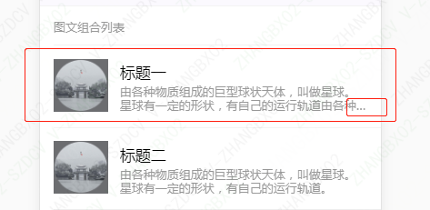

[bootstrap4媒体对象](https://getbootstrap.com/docs/4.2/components/media-object/)
一个div.media包含左右两栏，左边一般是个图片，右边div.media-body由标题和内容上下分布
```css
.media {
  display: flex;
  align-items: flex-start;
}
.media-body {
  flex: 1; /* flex-grow: 1; flex-shrink: 1; flex-basis: 0%; */
}
```
一般左右两栏之间有一定的间隔

左边图片有上中下三种位置布局
```css
.align-self-start {
  align-self: flex-start!important;
}
.align-self-center {
  align-self: center!important;
}
.align-self-end {
  align-self: flex-end!important;
}
```

[vux panel](https://vux.li/demos/v2/?x-page=v2-doc-home#/component/panel)
```html
<style>
  .weui-media-box_appmsg {
    display: flex;
    align-items: center;
  }
  .weui-media-box_appmsg .weui-media-box__hd {
    margin-right: .8em;
    width: 60px;
    height: 60px;
    line-height: 60px;
    text-align: center;
  }
  .weui-media-box_appmsg .weui-media-box__hd .weui-media-box__thumb {
    width: 100%;
    max-height: 100%;
    vertical-align: top;
  }
  .weui-media-box_appmsg .weui-media-box__bd {
    flex: 1;
    min-width: 0;
  }
  .weui-media-box__title {
    font-weight: 400;
    font-size: 17px;
    width: auto;
    overflow: hidden;
    text-overflow: ellipsis;
    white-space: nowrap;
    word-wrap: break-word;
    word-break: break-all;
  }
  .weui-media-box__desc {
    color: #999999;
    font-size: 13px;
    line-height: 1.2;
    overflow: hidden;
    text-overflow: ellipsis;
    display: -webkit-box;
    -webkit-box-orient: vertical;
    -webkit-line-clamp: 2;
  }
</style>
<a href="" class="weui-media-box_appmsg">
  <div class="weui-media-box__hd">
    
  </div>
  <div class="weui-media-box__bd">
    <h4 class="weui-media-box__title">标题一</h4>
    <p class="weui-media-box__desc">由各种物质组成的巨型球状天体，叫做星球。星球有一定的形状，有自己的运行轨道由各种物质组成的巨型球状天体，叫做星球。星球有一定的形状，有自己的运行轨道。</p>
  </div>
</a>
```


```css
/* 单行文字溢出虚点显示*/
.ell {
    text-overflow: ellipsis;
    white-space: nowrap;
    overflow: hidden;
}
```

```html
<style>
/* -webkit-line-clamp 多行文字溢出 */
.box {
    width: 100px;
    overflow: hidden;
    display: -webkit-box;
    -webkit-line-clamp: 2;
    -webkit-box-orient: vertical;
}
</style>
<div class="box">
    美国进口Culturelle康萃乐益生菌30片儿童水果味LGG益生菌咀嚼片
</div>
```
注意：-webkit-line-clamp是webkit的私有属性，是一个 不规范的属性（unsupported WebKit property），它没有出现在 CSS 规范草案中。
-webkit-line-clamp用来限制在一个块元素显示的文本的行数。 为了实现该效果，它需要组合其他的WebKit属性。常见结合属性：
- `display: -webkit-box;` 必须结合的属性 ，将对象作为弹性伸缩盒子模型显示 。
- -webkit-box-orient 必须结合的属性 ，设置或检索伸缩盒对象的子元素的排列方式 。

