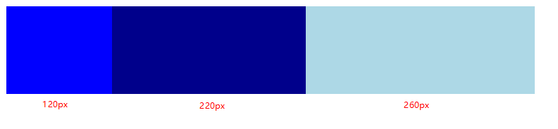

# 理解CSS属性flex值为1

[【CSS】由 flex: 1; 引发的思考](https://blog.csdn.net/u013451157/article/details/79011679)

flex 属性是 flex-grow, flex-shrink 和 flex-basis 的简写，flex 属性值可以由一部分组成，也可以由两部分组成，或者是三部分组成，其中的“部分”可以是非负整数、带单位的长度值、百分数。

flex 属性值最多有两个非负整数、最多有一个带单位的长度值或百分数，否则就是无效的 flex 属性值，即使设置了也不起作用。

flex 属性值中如果出现带单位的长度值或者百分数，则一定是 flex-basis 的值；如果有一个非负整数值，则是 flex-grow 的值；如果有两个非负整数值，则是依次是flex-shrink 和 flex-basis的值。

flex-basis 的值（带单位的长度值或者百分数）不一定只能出现再最后，出现在任意顺序都可以。

**flex-basis 值为 auto:**

如果元素设置了width（即 width 不为 auto），那么元素不伸缩时的初始大小就是 width；如果元素没有设置width，那么元素不伸缩时的初始大小就是内容（content）的大小。

当 flex 取值为 none，等价于

```css
.item {
  flex-grow: 0;
  flex-shrink: 0;
  flex-basis: auto;
}
```

当 flex 取值为 auto

```css
.item {
  flex-grow: 1;
  flex-shrink: 1;
  flex-basis: auto;
}
```

当 flex 取值为一个非负整数，则该数值为 flex-grow 值，flex-shrink 取 1， flex-basis 取 0%，如下是等同的：

```css
.item {flex: 1;}
.item {
  flex-grow: 1;
  flex-shrink: 1;
  flex-basis: 0%;
}
```

当 flex 取值为一个长度值或百分比，则视为 flex-basis 值， flex-grow 取1，flex-shrink 取1，如下是等同的：

```css
.item {flex: 0%;}
.item {
  flex-grow: 1;
  flex-shrink: 1;
  flex-basis: 0%;
}
```

```css
.item {flex: 24px;}
.item {
    flex-grow: 1;
    flex-shrink: 1;
    flex-basis: 24px;
}
```

当 flex 取值为两个非负数字，则分别视为 flex-grow 和 flex-shrink 的值，flex-basis 取 0%，如下是等同的：

```css
.item {flex: 2 3;}
.item {
  flex-grow: 2;
  flex-shrink: 3;
  flex-basis: 0%;
}
```

举一个不同的值之间的区别：

```html
<style>
    .parent {
        display: flex;
        width: 600px;
    }
    .parent > div {
        height: 100px;
    }
    .item-1 {
        width: 140px;
        flex: 2 1 0%;
        background: blue;
    }
    .item-2 {
        width: 100px;
        flex: 2 1 auto;
        background: darkblue;
    }
    .item-3 {
        flex: 1 1 200px;
        background: lightblue;
    }
</style>

<div class="parent">
    <div class="item-1"></div>
    <div class="item-2"></div>
    <div class="item-3"></div>
</div>
```

主轴上父容器总尺寸为600px，子元素的总基准值是：0% + auto + 200px = 300px，其中

- 0% 即 0 宽度
- auto 对应取主尺寸即 100px

主轴上有剩余空间，剩余空间为600px - 300px = 300px

各子元素放大系数为：2、2、1

剩余空间分配如下：

- item-1 和 item-2 各分配 2/5，各得 120px
- item-3 分配 1/5，得 60px

各项目最终宽度为：

- item-1 = 0% + 120px = 120px
- item-2 = auto + 120px = 220px
- item-3 = 200px + 60px = 260px



当 item-1 基准值取 0% 的时候，是把该项目视为零尺寸的，故即便声明其尺寸为 140px，也并没有什么用，形同虚设

而 item-2 基准值取 auto 的时候，根据规则基准值使用值是主尺寸值即 100px，故这 100px 不会纳入剩余空间


