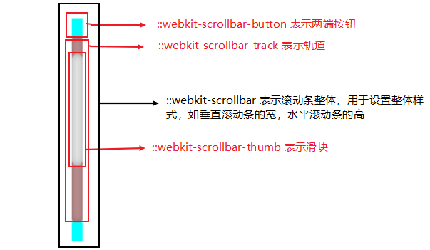
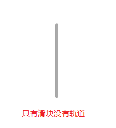
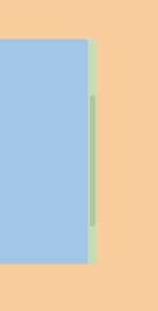
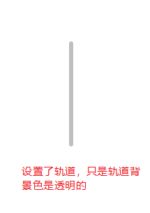
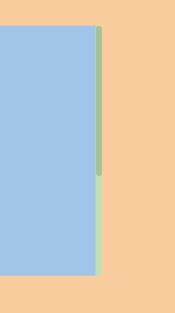
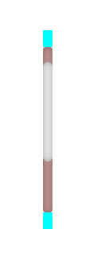
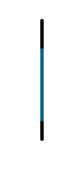

# 修改滚动条样式

[CSS3自定义滚动条样式 -webkit-scrollbar](https://www.cnblogs.com/lfhy/p/6796653.html)

滚动条的css样式主要由下面四个伪元素组成：

- ::-webkit-scrollbar   定义了滚动条整体的样式；
- ::-webkit-scrollbar-track  轨道部分；
- ::-webkit-scrollbar-thumb  滑块部分；
- ::-webkit-scrollbar-button  两端按钮；



例子1：

```css
/*---滚动条大小--*/
::-webkit-scrollbar{
    width:8px;
    height:8px;
}
/*---滚动条默认显示样式--*/
::-webkit-scrollbar-thumb{
    background-color:#ccc;
    -webkit-border-radius:4px;
    border: 2px solid #fff;
}
/*---鼠标点击滚动条显示样式--*/
::-webkit-scrollbar-thumb:hover{
    background-color:#aaa;
}
```





例子2：

```css
::-webkit-scrollbar {
    width: 5px;
    height: 5px;
    background-color: transparent;
}

::-webkit-scrollbar-track {
    border-radius: 5px;
    background-color: transparent;
}

::-webkit-scrollbar-thumb {
    border-radius: 5px;
    background-color: rgba(0, 0, 0, 0.25);
}
```






例子3：

```css
/*定义滚动条宽高及背景，宽高分别对应横竖滚动条的尺寸*/
::-webkit-scrollbar {
  width: 10px; /*对垂直流动条有效*/
  height: 10px; /*对水平流动条有效*/
}

/*定义滚动条的轨道颜色、内阴影及圆角*/
::-webkit-scrollbar-track{
  -webkit-box-shadow: inset 0 0 6px rgba(0,0,0,.3);
  background-color: rosybrown;
  border-radius: 3px;
}

/*定义滑块颜色、内阴影及圆角*/
::-webkit-scrollbar-thumb{
  border-radius: 7px;
  -webkit-box-shadow: inset 0 0 6px rgba(0,0,0,.3);
  background-color: #E8E8E8;
}

/*定义两端按钮的样式*/
::-webkit-scrollbar-button {
  background-color: cyan;
}
```



例子4：

该样式比较适用与大数据展示系统

```css
::-webkit-scrollbar {
  width: 6px;
  height: 6rem;
}
::-webkit-scrollbar-thumb {
  background-color: #116091;
  border-radius: 30px;
}

::-webkit-scrollbar-thumb:hover {
  background-color: #80cbfd;
}

::-webkit-scrollbar-track {
  background: #000;
  border-radius: 30px;
}
```

