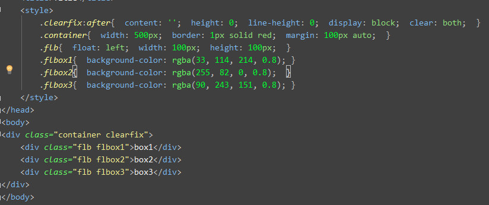
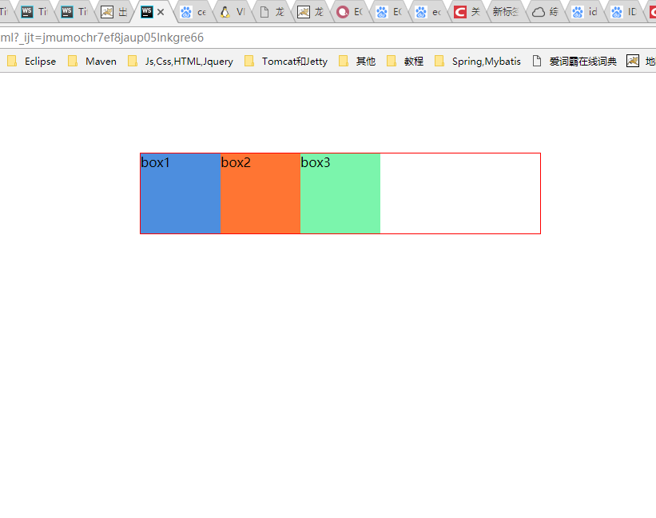
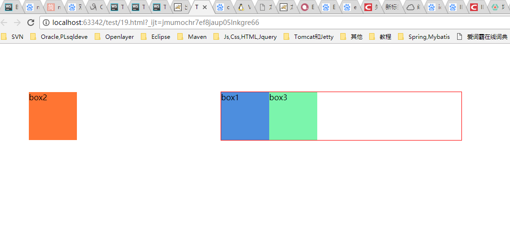
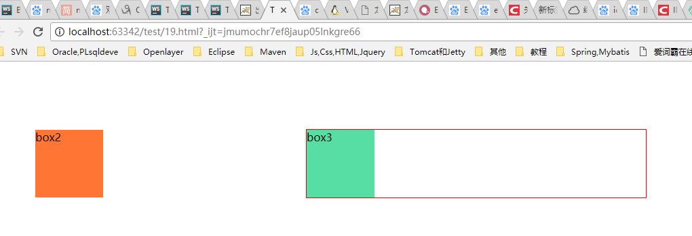

# 双飞翼布局

参考链接
- [http://www.jianshu.com/p/549aaa5fabaa](http://www.jianshu.com/p/549aaa5fabaa)

1 `.flbox2 margin-left:-500px;`，则`.flbox2`会向左偏移500px（以.flbox1的右边框为起点），之后`.flbox3`会紧贴`.flbox1`排列。如图：

2 同理，设置`.flbox3 margin-left:-100px;`，则其现在偏移（以`.flbox1`的右边框为起点），覆盖了`.flbox1`。

3 此时慢慢增大`.flbox1`的宽度，`.flbox1`的右边框会慢慢右移动，当`.flbox1`的宽度变为500px时，`.flbox1`的右边框右移动了500px-50px=450px；此时`.flbox2`，`.flbox1`，`.flbox3`看上去是从左到右依次排列，实际上`.flbox2`，`.flbox3`是覆盖在`.flbox1`上的。所以需要给`.inner`设置`margin-left: 50px; margin-right: 50px;`

