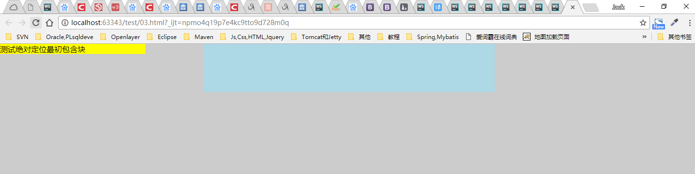
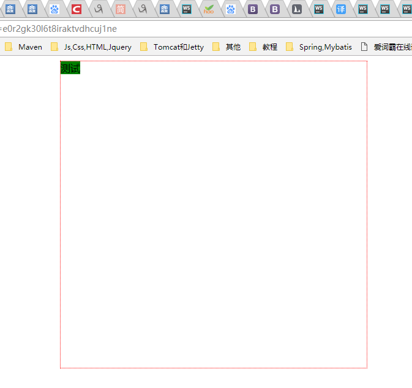
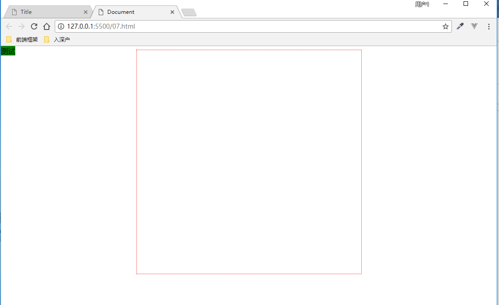
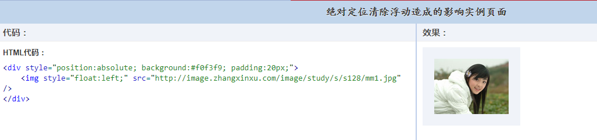
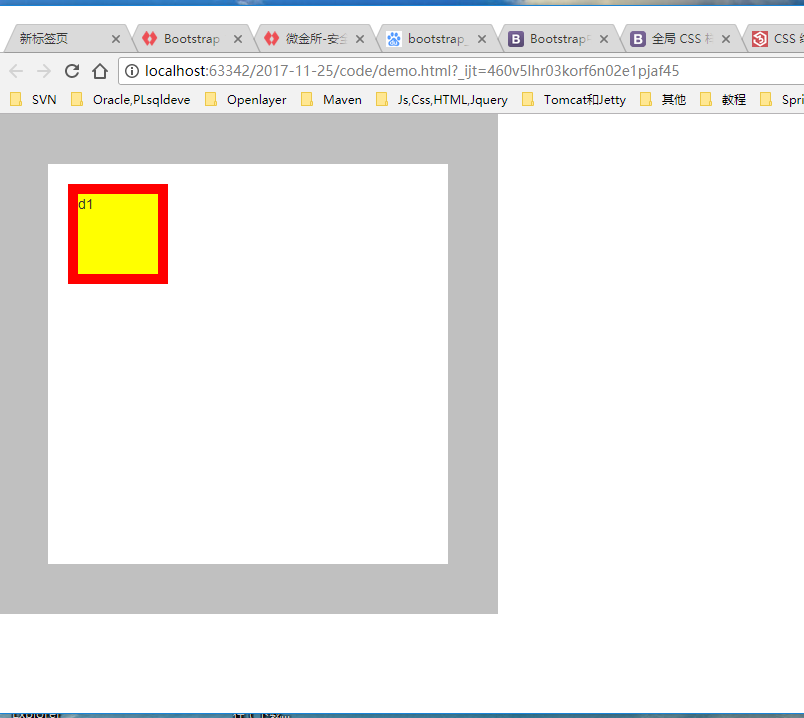
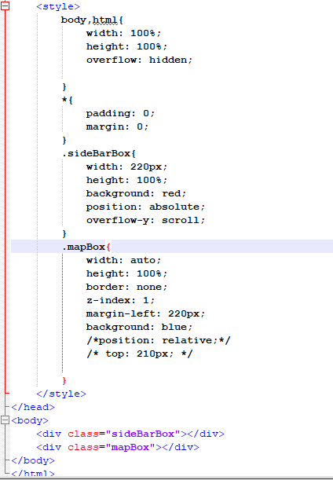
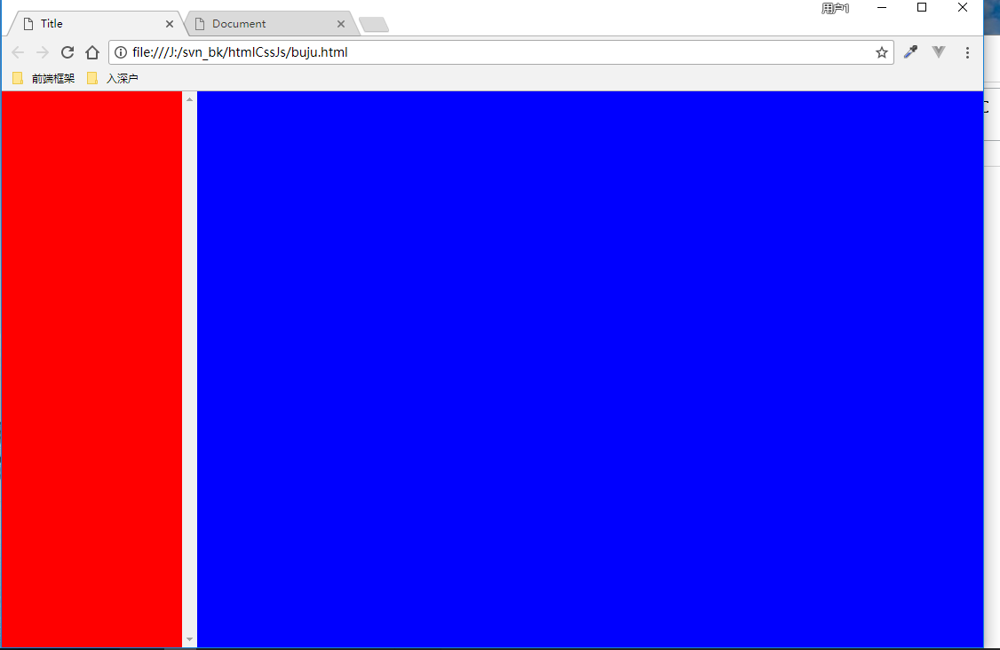

# 绝对定位

目录

- [1 最初包含块是 html](#1-最初包含块是-html)
- [2 display 类似 inline-block](#2-display-类似-inline-block)
- [3 父元素绝对定位，有类似清除浮动的作用](#3-父元素绝对定位有类似清除浮动的作用)
- [4 子元素绝对定位，父元素会塌陷](#4-子元素绝对定位父元素会塌陷)
- [5 父子元素的边界问题](#5-父子元素的边界问题)
- [6 布局](#6-布局)

## 1 最初包含块是 html

如果祖先元素找不到 position 为 relative，absolute，fixed，则相对最初的包含块定位。最初的包含块指的是 html。当仅设置`position: absolute;`而没有设置`top`、`right`、`bottom`、`left`时，此时元素跟设置`position: absolute;`之前的位置一样，只是元素已不再文档流中，不占据文档流空间。

```html
···
<style>
  html {
    background-color: #ccc;
  }
  body {
    width: 500px;
    margin: 0 auto;
    padding: 50px;
    background-color: lightblue;
  }
  div {
    position: absolute;
    top: 0;
    left: 0;
    width: 300px;
    background-color: yellow;
  }
</style>
<body>
  <div>测试绝对定位最初包含块</div>
</body>
```



## 2 display 类似 inline-block

元素定位后生成一个块级框，而不论原来它在正常流中生成何种类型的框。绝对定位后元素的 width 不能再 100%父元素，此时更像是“inline-block”,长度由内容撑开。

```html
···
<sytle>
  .d1 {
    width: 500px;
    height: 500px;
    margin: 0 auto;
    border: 1px solid red;
  }
  .d2 {
    position: absolute;
    background-color: green;
  }
</style>
<body>
  <div class="d1">
    <div class="d2">测试绝对定位元素宽度width是否扩展至父元素!</div>
  </div>
</body>
```



```html
···
<sytle>
  .d1 {
    width: 500px;
    height: 500px;
    margin: 0 auto;
    border: 1px solid red;
  }
  .d2 {
    position: absolute;
    top: 0;
    left: 0;
    background-color: green;
  }
</style>
<body>
  <div class="d1">
    <div class="d2">测试绝对定位元素宽度width是否扩展至父元素!</div>
  </div>
</body>
```



通过与上例比较，可以看出position:absolute;和position:absolute;top:0;left:0的区别。仅仅position:absolute;的元素还是在其父元素内部，但加了top,left后就不一定还在父元素内了。

## 3 父元素绝对定位，有类似清除浮动的作用

父元素绝对定位了，子元素设置了浮动，子元素却把父元素撑开了，其实这就能理解为绝对定位和浮动其实是把元素飘到另一个“平行世界”，在这个世界或者说层面上，绝对定位与浮动的元素是实体的，是要互相碰撞的，所以会撑开。



## 4 子元素绝对定位，父元素会塌陷

设置为绝对定位的元素框从文档流完全删除，因此其父元素会塌陷，有点类似浮动。

```html
···
<sytle>
  .d1 {
    border: 1px solid red;
  }
  .d2 {
    position: absolute;
  }
</style>
<body>
  <div class="d1">
    <div class="d2">测试绝对定位塌陷</div>
  </div>
</body>
```


## 5 父子元素的边界问题

子绝父相，当子元素top: 0; left:0; 时，子元素与父元素接触的边界是子元素外边距（或者边框、内边距、内容区，反正以最外层为边界）；父元素与子元素接触的边界是父元素的边框（或者说绝对定位子元素在父元素的内容区+内边距区内）

```html
···
<sytle>
  .d1 {
    position:relative; 
    width: 500px;
    height: 500px;
    padding: 40px
    border: 50px solid #c0c0c0;
  }
  .d2 {
    position: absolute;
    width: 100px;
    height: 100px;
    margin: 20px
    border: 10px solid red;
    top: 0;
    left: 0;
    background: yellow;
  }
</style>
<body>
  <div class="d1">
    <div class="d2">d1</div>
  </div>
</body>
```



## 6 布局



