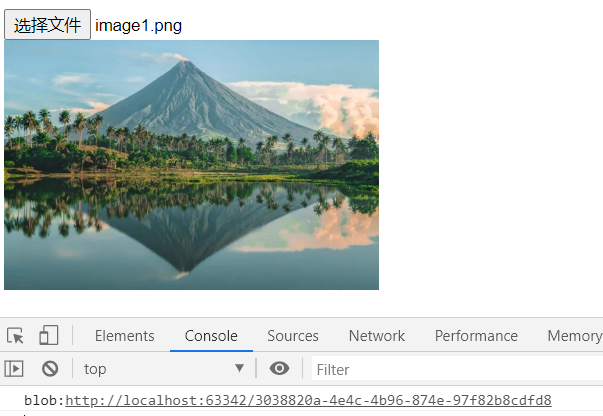
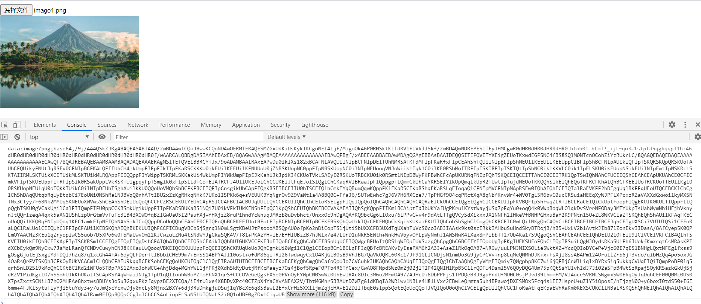

# Blob URL 和 Data URL的区别

[细说Web API中的Blob](https://www.jianshu.com/p/4d014a45aaf7)

1. Blob URL的长度一般比较短，但Data URL因为直接存储图片base64编码后的数据，往往很长，如上图所示，浏览器在显示Data URL时使用了省略号（…）。当显式大图片时，使用Blob URL能获取更好的可能性。

2. Blob URL可以方便的使用XMLHttpRequest获取源数据，例如：
  
    ```js
    var blobUrl = URL.createObjectURL(new Blob(['Test'], {type: 'text/plain'}));
    var x = new XMLHttpRequest();
    // 如果设置x.responseType = 'blob'，将返回一个Blob对象，而不是文本:
    // x.responseType = 'blob';
    x.onload = function() {
        alert(x.responseText);   // 输出 Test
    };
    x.open('get', blobUrl);
    x.send();
    ```

    对于Data URL，并不是所有浏览器都支持通过XMLHttpRequest获取源数据的。

3. Blob URL 只能在当前应用内部使用，把Blob URL复制到浏览器的地址栏中，是无法获取数据的。Data URL相比之下，就有很好的移植性，你可以在任意浏览器中使用。

除了可以用作图片资源的网络地址，Blob URL也可以用作其他资源的网络地址，例如html文件、json文件等，为了保证浏览器能正确的解析Blob URL返回的文件类型，需要在创建Blob对象时指定相应的type：

```js
// 创建HTML文件的Blob URL
var data = "<div style='color:red;'>This is a blob</div>";
var blob = new Blob([data], { type: 'text/html' });
var blobURL = URL.createObjectURL(blob);

// 创建JSON文件的Blob URL
var data = { "name": "abc" };
var blob = new Blob([JSON.stringify(data)], { type: 'application/json' });
var blobURL = URL.createObjectURL(blob);
```

## 1 Blob URL

```html
<!DOCTYPE html>
<html lang="en">
<head>
    <meta charset="UTF-8">
    <title>Title</title>
</head>

<body>
    <input type="file" accept="image/*" onchange="handleFile(this)">
    <br>
    
    <script>
        function handleFile(element) {
            var file = element.files[0];
            var fileUrl = window.URL.createObjectURL(file);
            console.log(fileUrl);
            var img = document.getElementsByTagName('img')[0];
            img.onload = function () {
                window.URL.revokeObjectURL(fileUrl)
            };
            img.src = fileUrl
        }
    </script>
</body>
</html>
```

在浏览器地址输入控制台中的Blob URL，无法打开文件。

## 2 Data URL



```html
<!DOCTYPE html>
<html lang="en">
<head>
    <meta charset="UTF-8">
    <title>Title</title>
</head>

<body>
    <input type="file" accept="image/*" onchange="handleFile(this)">
    <br>
    
    <script>
        function handleFile(element) {
            var file = element.files[0];
            var reader = new FileReader();
            var img = document.getElementsByTagName('img')[0];
            reader.onload = function (e) {
                console.log(e.target.result);
                img.src = e.target.result
            };
            reader.readAsDataURL(file)
        }
    </script>
</body>
</html>
```



在浏览器地址输入控制台中的Data URL，可以打开打开文件。

Web性能优化中有一项措施：把小图片用base64编码直接嵌入到HTML文件中，实际上就是利用了Data URL来获取嵌入的图片数据。

