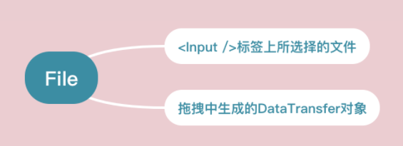

# File

[MDN File](https://developer.mozilla.org/zh-CN/docs/Web/API/File)

[在web应用程序中使用文件](https://developer.mozilla.org/zh-CN/docs/Web/API/File/Using_files_from_web_applications#Example.3A_Using_object_URLs_to_display_images)

File 接口基于 Blob，继承了 Blob 的所有属性和方法，File 对象可以看作一种特殊的 Blob 对象。

不像服务器端可以直接通过文件路径读取文件，Web应用可以通过下面方式读取计算机上的文件

