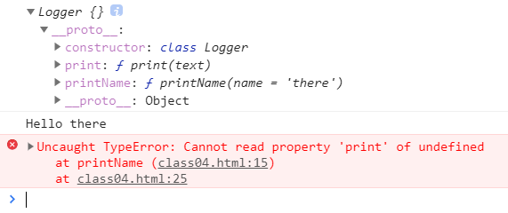
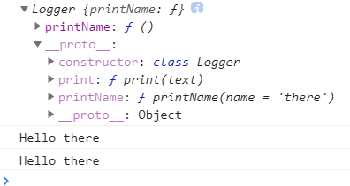

# this 的指向

printName 方法中的 this，默认指向 Logger 类的实例。如果将这个方法提取出来单独使用，this 会指向该方法运行时所在的环境（由于 class 内部是严格模式，所以 this 实际指向的是 undefined），从而导致找不到 print 方法而报错。

```js
class Logger {
  printName(name = 'there') {
    this.print(`Hello ${name}`)
  }
  print(text) {
    console.log(text)
  }
}
const logger = new Logger()
console.log(logger) // 一个空对象，原型上有printName、print方法

logger.printName() // Hello there

const { printName } = logger
printName() // Uncaught TypeError: Cannot read property 'print' of undefined
```




在构造函数中执行 `this.printName = this.printName.bind(this)`，使实例本身也具有 printName 方法，通过 bind 方法，实例本身的 printName 方法中的 this 被永久的绑定到 bind 方法的第一个参数（即实例本身），从而可以找到 print 方法。

```js
class Logger {
  constructor() {
    this.printName = this.printName.bind(this)
  }
  printName(name = 'there') {
    this.print(`Hello ${name}`)
  }
  print(text) {
    console.log(text)
  }
}
const logger = new Logger()
console.log(logger) // 一个有printName方法属性的对象，原型上有printName、print方法

logger.printName() // Hello there

const { printName } = logger
printName() // Hello there
```

