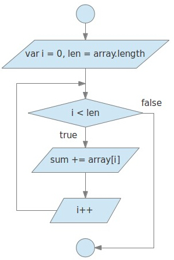

# for循环语句的执行顺序和优化

```js
for(为循环做的准备工作; 循环可以执行的条件; 代码主体执行后做的工作) {
   // 代码主体
}
```

```js
var sum=0;
var array=[1, 2, 3, 4, 5, 6, 7, 8, 9]
for(var i = 0, len = array.length; i < len; i++) {
  sum += array[i]
}
console.log(i) // 9
console.log(len) // 9
```

for循环语句的执行顺序简单介绍，图示如下：


按照语法结构对代码进行一下分析：

（1）.首先做循环准备工作，声明变量i并赋值为0，声明变量len并赋值为9，这个工作只做一次即可。
（2）.然后判断循环执行的条件是否满足，i<9，没问题，可以执行。
（3）.这里要注意了，执行条件满足后，并不是执行的i++，而是执行代码主体部分。
（4）.当执行完代码主体之后，才是去执行i++。
（5）.上面结束了一次完整的循环，这时候再来判断循环执行的条件是否成立，再执行代码主体，然后再执行代码主体执行后做的工作，如此往复下去，再强调一遍，准备工作只需要做一次即可。

for知识点补充：

```js
for (var i = 0; i < 9; i++) {
  console.log('hello')
}
console.log(i) // 9，可以发现在“为循环做的准备工作”中定义的变量变成了全局变量
```

因为“为循环做的准备工作”中定义的变量变为全局变量，因此准备工作部分没有必要非要在小括号中完成

```js
var i = 0
for (;i < 9; i++) {
  console.log('hello')
}
console.log(i)
```

**特别说明**：for后面的小括号中，分号有且只能有两个。
