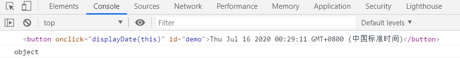
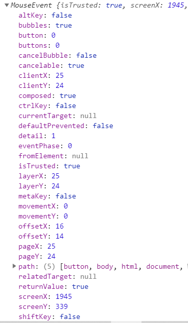
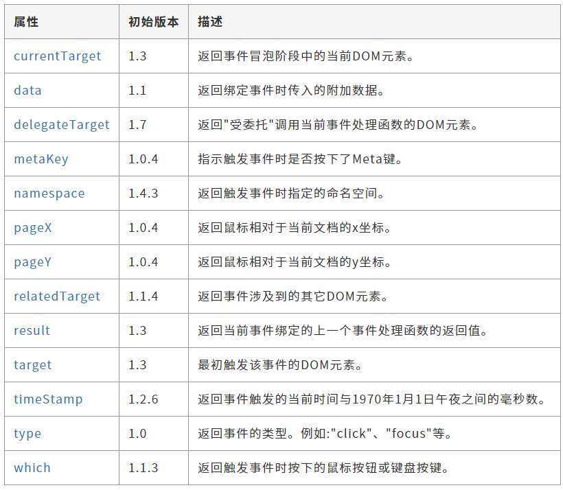

# 事件调用的几种方式

## 1 HTML 中

通过在元素上使用相应的事件属性，属性值是一段 Javascript 表达式。在用编辑器（如Webstorm）编写属性值时，会有代码提示功能，证明此处确实是Javascript 表达式。在表达式中 this 表示当前元素 **DOM 元素对象**。

如果逻辑比较多，使用表达式就显得不是很方便，可以将**逻辑包装进一个函数**中，然后表达式只写函数调用就行。

```html
<button type="button" onclick="console.log(this);console.log(this.innerHTML)">按钮</button>
```

``` html
<button type="button" onclick="handler(this)">按钮</button>

<script>
    function handler(el) {
        console.log(el)
        console.log(el.innerHTML)
    }
</script>
```

控制台输出：



## 2 JavaScript 中

### 2.1 通过 onxxxx 属性

事件处理器中的 this 表示当前 DOM 元素对象。默认会向事件处理器中传入事件对象。

事件对象由浏览器默认传入。不同的事件，其事件对象包含的属性不一定相同，下列打印的是 MouseEvent。

```html
<button typeof="button">按钮</button>
    
<script>
  document.getElementsByTagName('button')[0].onclick = function (e) {
    console.log(e);
    console.log(this);
    console.log(this.innerHTML)
  }
</script>
```

控制台输出：



### 2.2 通过 addEventListener 方法

事件处理器中的 this 表示当前 DOM 元素对象。默认会向事件处理器中传入事件对象。

```js
<button type="button">按钮</button>

<script>
    document.getElementsByTagName('button')[0].addEventListener('click', function (e) {
        console.log(e);
        console.log(this);
        console.log(this.innerHTML)
    });
</script>
```

## 3 通过jQuery

事件处理器中的 this 表示当前 DOM 元素对象。默认会向事件处理器中传入jQuery的Event对象，用于表示当前文档元素触发的DOM事件，它对JS原生的Event对象进行了封装，从而实现跨浏览器的兼容。该事件对象处理具备下列属性和方法外，还具备JS原生Event对象的属性和方法

```html
<button type="button">按钮</button>
<script src="plugin/jquery-3.3.1.js"></script>
<script>
    $('button').on('click', function (e) {
        console.log(e);
        console.log(this)
    })
</script>
```



## 4 vue是通过`v-on`简写`@`来绑定事件，如

```html
<div @click="handle"></div>
<div @click="handle()"></div> // 当无参数时，加不加括号没关系
```
