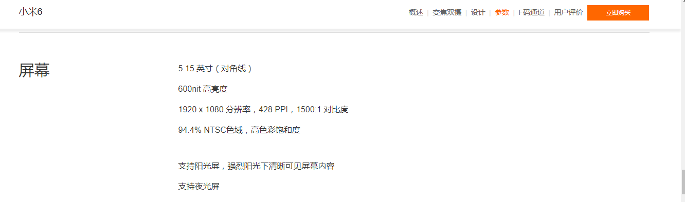
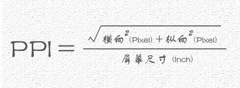
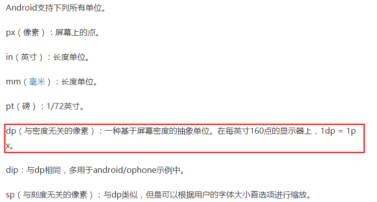
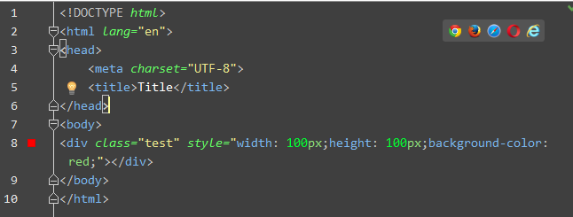
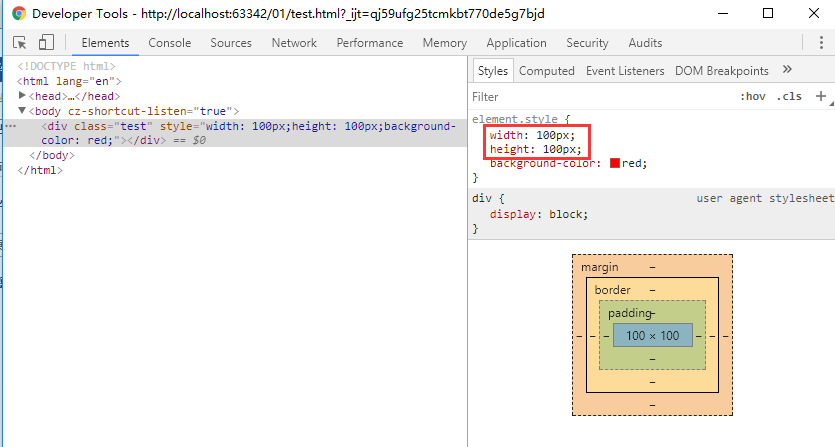
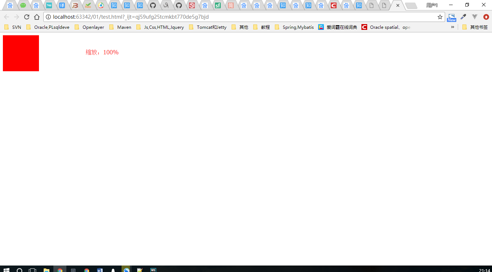
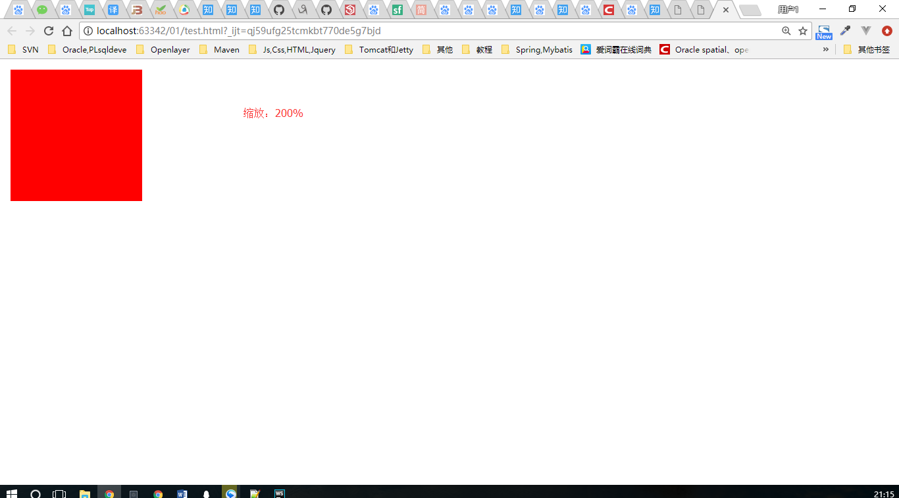
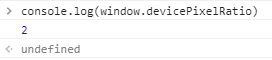
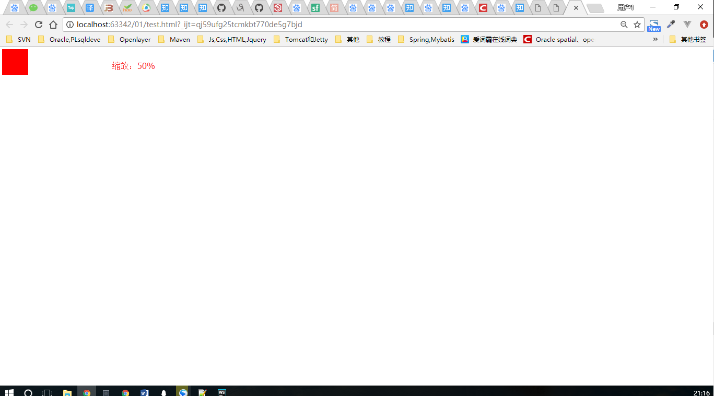
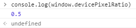

# 像素、分辨率和像素每英寸

参考链接：

- [设备像素，设备独立像素，CSS像素](#http://yunkus.com/physical-pixel-device-independent-pixels/)
- [设备像素比devicePixelRatio简单介绍](https://www.zhangxinxu.com/wordpress/2012/08/window-devicepixelratio/)
- [meta viewport 你真的了解吗？](http://yunkus.com/meta-viewport-usage/)

目录

- [1 像素](#1-像素)
- [2 分辨率](#2-分辨率)
- [3 PPI单位](#3-PPI单位)

## 1 像素

像素是组成图象的最基本单元要素：点。
看到像素（px），脑子里就应该想到这是一个点，或者是一张网的一个网孔。

## 2 分辨率

可以这样理解，把一个屏幕上铺一张网，每个网孔都是正方形，分辨率决定网孔的大小，多少）
分辨率是指在长和宽的两个方向上各拥有的像素个数。以每一个长度方向上的像素个数乖每一个宽度方向上的像素个数的形式表示。

如一张640X480的图片，表示这张图片在每一个长度的方向上都有640个像素点，而每一个宽度方向上都480个像素点，总数就是640X480=307200（个像素），简称30万像素。

## 3 PPI单位

英寸(inch,缩写为in.)，一英寸为2.54cm。

PPI是Pixels Per Inch缩写，pixels per inch所表示的是每英寸所拥有的像素（pixel）数目。手机屏幕的PPI当达到一定数值时，人眼就分辨不出颗粒感了。PPI的倒数就是每像素的长度大小，单位是英寸。

PPI的值越高，画质越好，也就是越细腻，看起来更有逼格。

其实计算方法很简单，用长跟高的像素数计算出对角方向的像素数（直角三角形），然后再用对角的像素数除以屏幕尺寸就是ppi了,公式表达为 PPI=√（X^2+Y^2）/ Z （X：长度像素数；Y：宽度像素数；Z：屏幕大小，即对角线长度）。√（1920^2+1080^2）/ 5.15=427.748965，约等于428

一个像素有多大呢？主要取决于显示器的分辨率（也就是取决于网孔的大小），相同面积不同分辨率的显示屏，其像素点大小就不相同。对某一台设备（如笔记本显示器），其显示器的大小是固定的，而分辨率是可以调整的，选择不同的分辨率，每一个像素的大小是不同的，因此清晰度也不一样。

显示屏的尺寸是指其对角线的长度，用英寸表示，1英寸=25.4毫米。

我们以一款手机为例来说明这个问题。其主屏尺寸：4寸，主屏分辨率：800x480像素，通过勾股定理计算可知其长宽为3.430寸X2.058寸（87.1毫米X52.3毫米）。800/3.430=233，即每英寸长度有233个像素，每一个像素有87.1/800=0.109毫米大。
注意区别DPI，即Dots Per Inch

**设备像素**：设备像素又称物理像素（physical pixel），设备能控制显示的最小单位，我们可以把这些像素看成显示器上的一个点。（好比家里蒸笼中的格子）

**css像素**：css像素是web编程的概念，独立于设备的用于逻辑上衡量像素的单位，也就是说我们在做网页时用到的css像素单位，是抽象的，而不是实际存在的。（好比可以活动的晾衣架、足球桌游等）
设备独立像素：（DIP，device-independent pixel，density-independent pixel，也叫密度无关像素），独立于设备的用于逻辑上衡量像素的单位。这个点代表一个可以由程序使用并控制的虚拟像素（比如：css像素，只是在安卓机中css像素就不叫“css像素”了，而是叫“设备独立像素”）（好比可以活动的晾衣架、足球桌游等）

个人理解：

- 设备像素（即物理像素）是由设备的硬件条件决定的，平时做web时css中的“px”指的是css像素，手机（安卓机）中的css像素指的是独立像素。
- 设备像素的大小是固定的（如果不更改电脑屏幕分辨率），即一个设备像素边长为1mm（瞎写的，实际应该很小），而css像素/设备独立像素大小不是固定的（下面的图片说明的就是这个）。设备像素与css像素/设备独立像素之间存在一定关系。

在一定的条件下两者它们两者是可以相等的，比如：在PC端浏览器默认情况下（100%，即页面没被缩放），一个物理像素 = 一个设备独立像素。而在移动端可就不一样的，这两个值很多时候是不相等的。为什么会不相等，因为为了让你看起来更爽，爽在哪里？就是画质的精细度。即使它们有关系，但又不相等，那么总得有个说法或者公式吧？别急，在这之前，我们还得认识个东西叫PPI。

window.devicePixelRatio（设备像素比）是设备像素（物理像素）和设备独立像素的比值。

放大的过程：假设屏幕是物理宽1000in,开始时设备像素和设备独立像素（x方向，即水平方向，或宽有1000个像素点）都是1000px（即一个像素边长1in）,放大200%后，设备像素还是1000px没变，但设备像素变成了500px(现在一个设备像素2in),对于宽高都是100px的div,原来宽高是100in，现在边长了200in。缩放通过改变网孔的大小，从而改变水平方向设备独立像素的多少，即放大水平方向设备独立像素会变少，网孔变大；缩小水平方向设备独立像素会变多，网孔变小。

缩放在移动设备更常见。

屏幕水平长度1000in，水平设备像素1000px，原始设备独立像素1000px。

 "|原始|缩放：200%后
:--|:--|:--
一个设备独立像素（即1px）的实际大小|1in|2in
div width:100px div的宽度|100in|200in
设备像素和设备独立像素的比|1000px/1000px=1|1000px/500px=2

div设置的css的尺寸使用始终是100px，这里px指的是css像素，但随着缩放不同，看到的div尺寸也不同（看到的尺寸，即就是设备像素）

微信小程序：
rpx（responsive pixel）: 可以根据屏幕宽度进行自适应。规定屏幕宽为750rpx。如在 iPhone6 上，屏幕宽度为375px（设备独立像素），共有750个物理像素，则750rpx = 375px = 750物理像素（这里本来也可以写成“px”，但是如果这样写，就和前面的一样了，这里是为了区分），1rpx = 0.5px = 1物理像素。
