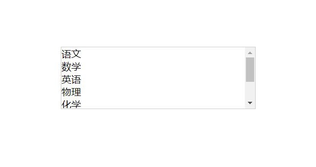
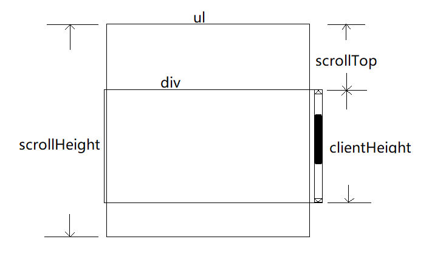

clientHeight

[MDN](https://developer.mozilla.org/zh-CN/docs/Web/API/Element/clientHeight)

是元素内部的高度(单位像素)，包含内边距，但不包括水平滚动条、边框和外边距。

clientHeight 可以通过 CSS height + CSS padding - 水平滚动条高度 (如果存在)来计算.


scrollTop

[MDN](https://developer.mozilla.org/zh-CN/docs/Web/API/Element/scrollTop)

一个元素的 scrollTop 值是这个元素的内容顶部（卷起来的）到它的视口可见内容（的顶部）的距离的度量。当一个元素的内容没有产生垂直方向的滚动条，那么它的 scrollTop 值为0

scrollHeight

[MDN](https://developer.mozilla.org/zh-CN/docs/Web/API/Element/scrollHeight)

这个只读属性是一个元素内容高度的度量，包括由于溢出导致的视图中不可见内容。

```html
<style>
* {
  padding: 0;
  margin: 0;
}
.wrapper {
  height: 100px;
  margin: 100px;
  overflow-y: auto;
  border: 1px solid #ccc;
}
</style>
<div class="wrapper">
  <ul class="list">
    <li>语文</li>
    <li>数学</li>
    <li>英语</li>
    <li>物理</li>
    <li>化学</li>
    <li>地理</li>
    <li>政治</li>
    <li>思想</li>
  </ul>
</div>
<script>
function throttle(func, wait) {
  var context, args;
  var previous = 0;

  return function() {
    var now = +new Date();
    context = this;
    args = arguments;
    if (now - previous > wait) {
      func.apply(context, args);
      previous = now;
    }
  }
}

const d = document.getElementsByClassName('wrapper')[0]
d.onscroll = throttle(() => {
  if (this.clientHeight + this.scrollTop + 10 >= this.scrollHeight) {
    // 触底了
  }
}, 1000)
</script>
```



