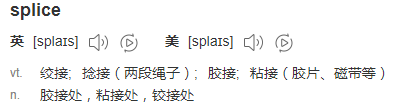
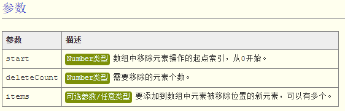
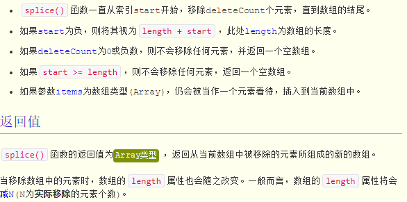
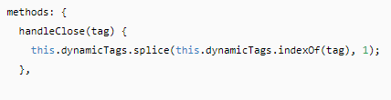
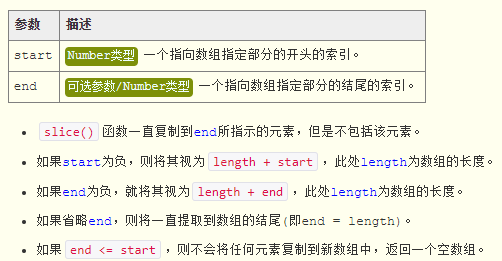
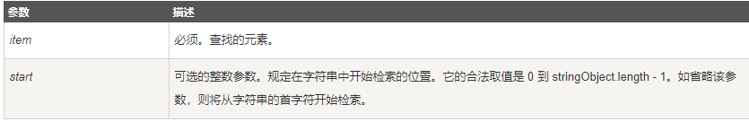
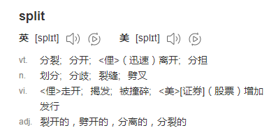

# 数组和字符串

目录
- [数组和字符串](#%E6%95%B0%E7%BB%84%E5%92%8C%E5%AD%97%E7%AC%A6%E4%B8%B2)
  - [1 数组](#1-%E6%95%B0%E7%BB%84)
    - [1.1 splice()](#11-splice)
    - [1.2 concat()](#12-concat)
    - [1.3 slice()](#13-slice)
    - [1.4 filter()](#14-filter)
    - [1.5 forEach()](#15-foreach)
    - [1.6 indexOf()](#16-indexof)
    - [1.7 map()](#17-map)
    - [1.8 some()](#18-some)
    - [1.9 find()](#19-find)
  - [2 字符串](#2-%E5%AD%97%E7%AC%A6%E4%B8%B2)
    - [2.1 slice()](#21-slice)
    - [2.2 substring()](#22-substring)
    - [2.3 substr()](#23-substr)
    - [2.4 indexOf()](#24-indexof)
    - [2.5 charAt()](#25-charat)
  - [3 数组和字符串的相互转换](#3-%E6%95%B0%E7%BB%84%E5%92%8C%E5%AD%97%E7%AC%A6%E4%B8%B2%E7%9A%84%E7%9B%B8%E4%BA%92%E8%BD%AC%E6%8D%A2)
    - [3.1 join()](#31-join)
    - [3.2 split()](#32-split)
  - [4 综合例子](#4-%E7%BB%BC%E5%90%88%E4%BE%8B%E5%AD%90)

> 对数组的操作方法可能改变原数组变量的，但对字符串的操作方法式不会改变原字符串变量的。

## 1 数组

### 1.1 splice()

> 最强大的数组方法

参考链接：
- [JavaScript Array.splice() 函数详解](http://www.365mini.com/page/javascript-array-splice.htm)
- [小结concat()、slice()、splice()操作方法](http://blog.csdn.net/natalie86/article/details/44236763)



从当前数组中移除一部分连续的元素(或者还可以在所移除元素的位置上插入一个或多个新的元素)，以数组形式返回从当前数组中被移除的元素。如：

用法：`array.splice( start, deleteCount [,items... ] )`





```js
var array = ['a','b','c','d']; 
var removeArray = array.splice(0,2); 
alert(array); // 弹出c,d ，即原数组变为剩下删除后的内容
alert(removeArray); // 返回值为删除项，即弹出a,b ，删除项组成一个新数组
```

见到array.splice(0,2)应知道：
删除了原数组array索引0、1两位的元素；array.splice(0,2)本身表示一个数组，由原数组0、1两位组成。

常用array.splice(3,1),来删除原数组中特定位置的元素。如：

```js
var arr = ['a','b','c','d']
var a = arr.indexOf('b')

arr.splice(a, 1) // 删除特定位置元素
console.log(arr) // ['a','c','d']

arr.splice(0, 1, 'e') // 删除第一个元素并替换为'e'
console.log(arr) // ['e','c','d']
```
vue中例子：


### 1.2 concat()

语法：`array.concat( item1 [,items... ] )`

具体用法是：它可以创建当前数组的一个副本，然后将接受到的参数添加到这个副本的末尾，最后返回新构建的数组。这里又分三种情况。
- 在没有给concat()方法传递参数的情况下，它只是复制当前数组并返回副本。
- 如果传递给concat()方法的是一或多个数组，则该方法会将这些数组中的每一项都添加到结果数组中。
- 如果传递的值不是数组，这些值就会被简单地添加到结果数组的末尾。

### 1.3 slice()

函数返回当前数组的一部分(连续的一段，以数组的形式返回)。

语法：`array.slice( start [, end ] )`



```js
var a = [1, 2, 3, 4]
var b = a.slice(2, 3)
console.log(b) // [2]
```
slice()跟splice()作用类似，参数不同，slice()传入开始和结束索引，splice()传入开始索引和截取的长度，类似于字符串的substr()和substring()

### 1.4 filter()
参考链接：
- [5个数组Array方法: indexOf、filter、forEach、map、reduce使用实例](https://www.jb51.net/article/60502.htm)
- [Js 数组——filter()、map()、some()、every()、forEach()、lastIndexOf()、indexOf()](https://www.cnblogs.com/xiao-hong/p/3194027.html)

创建一个新的数组，新数组中的元素是通过检查指定数组中符合条件的所有元素

语法：`array.filter(function(item, index, arr){})`
item表示当前遍历的数组项，index表示当前遍历项的索引，arr表示当前项的数组对象，回调函数要有return语句

返回值：返回一个由符合条件的元素组成的新数组，如果没有符合条件的元素则返回空数组。

对数组中的每个元素都执行一次指定的函数（callback），并且创建一个新的数组，该数组元素是所有回调函数执行时返回值为 true 的原数组元素。

```js
var a = [1, 2, 'zbx', 'hello']
var b = a.filter(function(item) {
  return (typeof item) == 'sting'
})
console.log(b) // ['zbx', 'hello']
```

### 1.5 forEach()

数组每个元素都执行一次回调函数。

语法：`array.forEach(function(item, index){})`

```js
var a = [1, 2, 'zbx', 'hello']
a.forEach(function(item, index) {
  console.log(index + '--->' + item)
})
// 0--->1
// 1--->2
// 3--->zbx
// 4--->hello
```

### 1.6 indexOf()

返回元素第一次在数组中出现的位置，如果在数组中没找到指定元素则返回-1，如果你想查找字符串最后出现的位置，请使用 lastIndexOf() 方法。

语法：`array.indexOf(item, start)`



```js
var arr = ['apple','orange','pear'];
console.log("\'orange\' isHave?", arr.indexOf("orange") != -1); //'orange' isHave? true
```
上述例子如果不用indexOf()

```js
var arr = ['apple','orange','pear'],
  found = false
for(var i= 0, l = arr.length; i< l; i++){
  if(arr[i] === 'orange'){
    found = true
  }
}
console.log("\'orange\' isHave?",found) //'orange' isHave? true
```

判断一个数组（对象数组）中是否含有某一项的方法，这个方法常用

```js
var a = [
  {id: 1, name: 'qq'},
  {id: 2, name: 'ww'},
  {id: 3, name: 'ee'},
  {id: 4, name: 'rr'},
  {id: 5, name: 'tt'}
]
var isHave = false;
for(var i=0; i<a.length; i++){
  if(a[i].id === 3){
    isHave = true
  }
}
console.log('having id equal to 3?', isHave)
```

### 1.7 map()

返回一个新数组，数组中的元素为原始数组元素调用函数处理后的值，该方法不改变原数组。

用法：`array.map(function(item, index, arr){})`

callback需要有return值。这个可以结合es6的箭头函数。

```js
var oldArr = [{firstname: 'colin', lastname: 'toh'}, {firstname: 'addy', lastname: 'osmani'}]
var newArr = oldArr.map((item, index) => {
  var temp = {
    firstname: item.firstname,
    lastname: item.lastname,
    fullname: item.fullname,
  }
  return temp
})
```

不用map()

```js
var oldArr = [{firstname: 'colin', lastname: 'toh'}, {firstname: 'addy', lastname: 'osmani'}]
var newArr = []
for(var i = 0; i < oldArr.length; i++) {
  var temObj = {}
  temObj.firstname = oldArr[i].firstname
  temObj.lastname = oldArr[i].lastname
  temObj.fullname = oldArr[i].firstname + ' ' + oldArr[i].lastname
  newArr.push(temObj)
}
```
注意：

```js
var parse = function (item) {
  item = item.toString()
  return item + '_item'
}
var a = [1, 2, 3]
var b = a.map(parse) // 这是正确的
var b = a.map(parse()) // 这样写是错的
```

### 1.8 some()

用于检测数组中的元素是否满足指定条件，some() 方法会依次执行数组的每个元素：

- 如果有一个元素满足条件，则表达式返回true , 剩余的元素不会再执行检测。
- 如果没有满足条件的元素，则返回false。

语法：`array.some(callback[,thisargs])`

**注意**：some() 不会改变原始数组。

`array.indexOf()`也有类似的功能，但功能没有some强大，如下面第二个例子，我只想知道对象数组中有没有id为3的对象（我并不知道name的值），此时用some就显得很方便了。

```js
var arr = [1, 2, 3, 4, 5, 6]
var result = arr.some(function (item) {
  return item % 2 == 0
})
```

用some改写indexOf()中例子

```js
let a = [
  {id: 1, name: 'qq'},
  {id: 2, name: 'ww'},
  {id: 3, name: 'ee'},
  {id: 4, name: 'rr'},
  {id: 5, name: 'tt'},
]
if (a.some(item => item.id === 3)) {
  console.log('having id equal to 3?', true)
}
```

上例的常规写法

```js
let a = [
  {id: 1, name: 'qq'},
  {id: 2, name: 'ww'},
  {id: 3, name: 'ee'},
  {id: 4, name: 'rr'},
  {id: 5, name: 'tt'},
]

const isHave = (arr) => {
  let flag = false
  for (let i = 0; i < arr.length; i++) {
    if (arr[i].id === 3) flag = true
  }
  flag ? console.log('having id equal to 3?', true) : console.log('having id equal to 3?', false)
}
```

### 1.9 find()

该方法的参数为一个函数，返回数组中符合条件的第一个元素

语法： `array.find(function(item, index){})`

- 当数组中的元素在测试条件时返回 true 时, find() 返回符合条件的元素，之后的值不会再调用执行函数。
- 如果没有符合条件的元素返回 undefined。

```js
var ages = [3, 10, 18, 20]
ages.find(item => item >= 18) // 18
```

## 2 字符串

### 2.1 slice()

用于返回当前字符串中一个连续的片段。

语法：`stringObject.slice( startIndex [, endIndex] )`

### 2.2 substring()

用于返回当前字符串中一个连续的片段。

语法：`stringObject.substring( startIndex, endIndex )`

### 2.3 substr()

用于返回当前字符串中一个连续的片段。

语法：`stringObject.substr( startIndex [, length ] )`

### 2.4 indexOf()

返回某个指定的字符串值在字符串中首次出现的位置。

语法：`stringObject.indexOf(searchvalue[,fromindex])`

如果要检索的字符串值没有出现，则该方法返回 -1。
开始检索的位置在字符串的 fromindex 处或字符串的开头（没有指定 fromindex 时）。如果找到一个 searchvalue，则返回 searchvalue 的第一次出现的位置。不管有无fromindex，返回值都是相对原字符串的index，如

```js
var cc = ‘hello world’;
var nn = cc.indexOf(‘w’); //6
var a = cc.indexOf(‘w’, 2); //6
var b = cc.indexOf(‘w’, 4); //6
var c = cc.indexOf(‘w’, 8); //-1
```


### 2.5 charAt()

返回指定位置的字符

语法：`stringObject.CharAt(index)`

## 3 数组和字符串的相互转换

### 3.1 join()

join()函数返回一个字符串，该字符串由当前数组的所有元素，并且元素之间以指定的分隔符连接起来所组成。

语法：`array.join(separator)`

separator为指定元素间的分隔符，如果省略该参数，则使用逗号作为分隔符。

```js
var array = ["CodePlayer", true, -5.1];
alert(array.join(" "));         // 以空格相连，CodePlayer true -5.1
alert(array.join(""));         //以空字符串相连， CodePlayertrue-5.1
alert(array.join()) ;          //省略参数， CodePlayer,true,-5.1
```

### 3.2 split()



语法：`stringObject.split( separator [, hownamy ] )`

separator 字符串或正则，表示在字符串哪些地方进行分割，即把字符串中所有的该字符替换成逗号（虽然这样理解不严谨）
howmany 数字，该参数可指定返回的数组的最大长度
**注意**：如果把空字符串 ("") 用作 separator，那么 stringObject 中的每个字符之间都会被分割。

```js
var str = 'How are you doing today?' // 要把str看成一个整体，如看成一个很长的单词，空格也是字符
console.log(str.split('')) // ["H", "o", "w", " ", "a", "r", "e", " ", "y", "o", "u", " ", "d", "o", "i", "n", "g", " ", "t", "o", "d", "a", "y", "?"]
console.log(str.split(' ')) // ["How", "are", "you", "doing", "today?"]
console.log(str.split('o')) // ["H", "w are y", "u d", "ing t", "day?"]
console.log(str.split(' ', 3)) // ["How", "are", "you"]
```

如果在`stringObject`中没找到`separator`，则把`stringObject`整体作为数组的一项
```js
var str1 = 'hello'
console.log(str1.split(',')) // ["hello"]
```

## 4 综合例子

1 将字符串逆序

`str.split("").reverse().join("")`

```js
var str="How are you doing today?"
console.log(str.split("").reverse().join("")) // ?yadot gniod uoy era who
```

2 首字母大写

```js
var a = 'hello world';
console.log(a.charAt(0).toUpperCase() + a.slice(1)) // Hello world
```

3 将数组的某一元素上移或者下移

```js
var array = ['1', '2', '3', '4', '5']

// type值为'up'、'down'，表示上移或下移；array表示数组；index表示需要移动元素的索引
function upOrDown(type, index) {
    if (type === 'up' && index === 0) {
        return false
    } else if (type === 'down' && index === (array.length - 1)) {
        return false
    }
    var changeItem = type === 'up' ? array[index-1] : array[index+1]
    if (type === 'up') {
        array.splice(index-1, 1, array[index])
    } else {
        array.splice(index+1, 1, array[index])
    }
    array.splice(index, 1, changeItem)
}


```

4 将字符串首字母大写
```javascript
var name = 'jack'
console.log(name.substring(0, 1).toUpperCase() + name.substring(1))  // Jack
```
