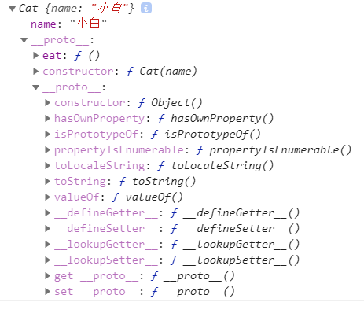

# 继承与原型链

[继承与原型链](https://developer.mozilla.org/zh-CN/docs/Web/JavaScript/Inheritance_and_the_prototype_chain)

这边文章很详细，有几个重点如下：

## 1 重要概念

每个实例对象都有一个私有属性（称之为 `__proto__`）指向它的构造函数的原型对象（prototype）。该原型对象也有自己的原型对象（`__proto__`），层层向上直到一个对象的原型对象为null。根据定义，null没有原型，并作为这个原型链中的最后一个环境。

可以这样理解，每一个对象都有一个父对象，父对象也有它自己的父对象，最顶层的父对象是null。类似Java中类、父类、父类的父类。

父对象是什么意思呢？即以这个父对象为“模子”来创建子对象，如父对象 fatherObj 是`{a: 1, b: 2}`，那么子对象 subObj 也具备属性a、b。

如何表示一个对象的父对象呢？用`__proto__`表示，即`subObj.__proto__`。

## 2 画原型链

当访问一个对象的属性时，会自底向上遍历原型链查找属性，如果能找到，返回结果，停止遍历，找不到，返回undefined

例子一：

```js
var o = {a: 1}
```

o ---> Object.prototype ---> null

例子二：

```js
function Cat (name) {
  this.name = name
}
Cat.prototype.eat = function () {
  console.log('eat fish')
}

var cat = new Cat('小白')
```

cat ---> Cat.prototype ---> Object.prototype ---> null

即：

{name: '小白'} ---> {eat: ..., constructor: ...} ---> {hasOwnProperty: ...} ---> null



例子三：

```js
var a = ['yo', 'whadup', '?']
```

数组都继承于 Array.prototype，其中包含 indexOf, forEach 等方法，原型链如下

a ---> Array.prototype ---> Object.prototype ---> null

例子四：

```js
function f(){
  return 2;
}
```

函数都继承于 Function.prototype，其中都包含 call, bind等方法，原型链如下

f ---> Function.prototype ---> Object.prototype ---> null
