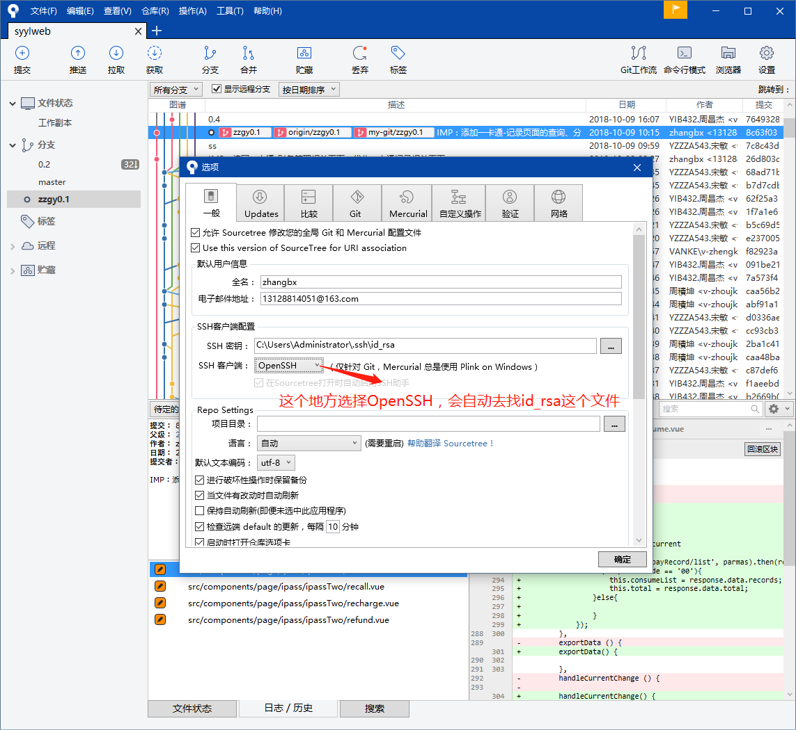

# git笔记

## 1 使用sourceTree将本地项目通过ssh上传到github上

- 首先本地安装了git，并且生成了公私钥：id_rsa、id_rsa.pub，然后将公钥id_rsa.pub的内容添加到github
  - 查看是否有.ssh目录：如C:\Users\Administrator\\.ssh，如果有，再看看这个目录下有没有id_rsa和id_rsa.pub这两个文件，如果没执行命令`ssh-keygen -t rsa -C "youremail@example.com"`生成
  - 在sourceTree中，给项目添加github仓库地址，设置-添加
  - 工具-选项
    

## 2 常用git命令

1. `git clone [url]`
   克隆一个仓库，clone下来的repo会以url最后一个斜线后面的名称命名,创建一个文件夹,如果想要指定特定的名称,可以`git clone [url] newname`指定.

## 3 问题解决

有时候在官网下载git很慢，甚至失败，可以去[腾讯软件中心](https://pc.qq.com/detail/13/detail_22693.html)下载
