# C 盘清理

## 1 第一步：清理 Win10 升级留下的 Windows.old 文件夹、系统临时文件等

1.1 打开此电脑（也就是之前的我的电脑），然后在C盘上点右键，选择属性，然后在属性对话框中，点击"磁盘清理"；

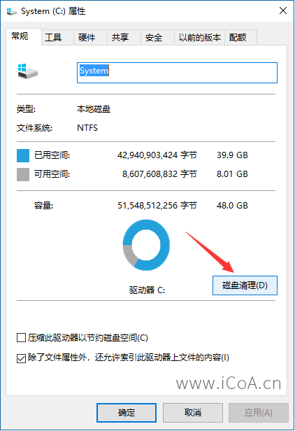

1.2 打开磁盘清理之后，在对话框中间偏下的位置，点击"清理系统文件"的按钮；

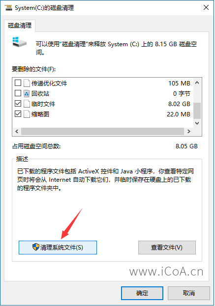

1.3 在新打开的对话框中，要删除的文件下面，找到"以前的Windows安装"选项，选中。同时因为我们要清理临时文件，所以也可以选中临时文件选项，点击确定即可。；

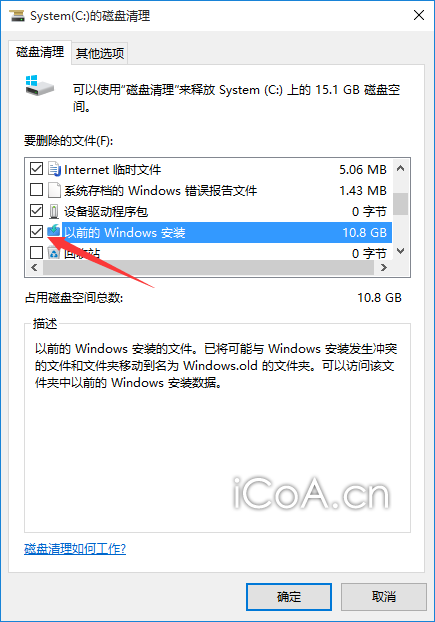

有人说为什么没有这个选项，那么可以还有另外一个"**Windows 更新清理**"可以选中。


1.4 点击确定之后，会提示"如果清理你以前的 Windows 安装或临时安装文件，则不能将计算机恢复到以前版本的Windows。是否确定要这样做？"然后点"是"。然后 Windows.old 和 临时文件就从C盘消失了。

## 2 第二步：转移虚拟内存到其他盘符

什么是虚拟内存？虚拟内存一般是用在内存不足的情况下，系统自动调用硬盘的空间，用来暂时替代不够的内存工作（虚拟内存用的是硬盘空间）。我的笔记本装的是16G的内存条，默认情况下依然有虚拟内存，且默认用C盘空间。

此步骤的目的是将用作虚拟内存的盘由C盘改为其他盘，该步骤能让C盘容量提高几个G。

2.1 在 【此电脑】上点右键选择【属性】，然后在打开页面，点击左边的 【高级系统设置】 选项，在打开的 系统属性 对话框里，选择【高级】→【设置】，打开【性能选项】对话框；

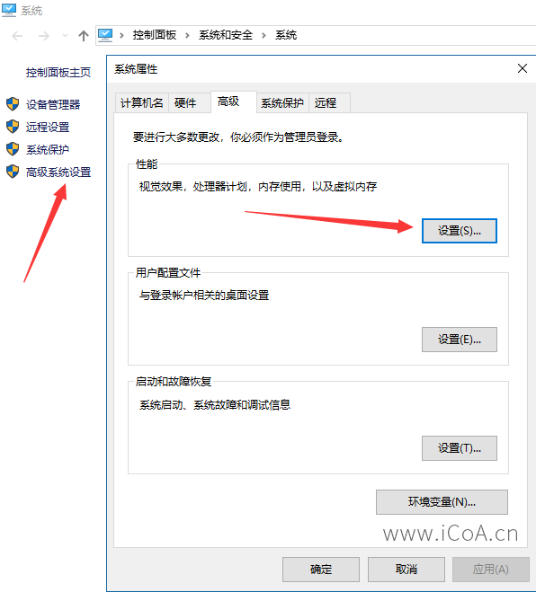

2.2 然后在打开的【性能选项】对话框，选择【高级】→【更改】，打开【虚拟内存】设置；


2.3 在打开的【虚拟内存】设置对话框里，选择一个硬盘空间比较大的盘符（比如这里选择了E盘），点击【系统管理的大小】，然后点击【设置】，点击【确定】，会提示让你重启电脑，**一定要重启电脑再进行下面的操作**。

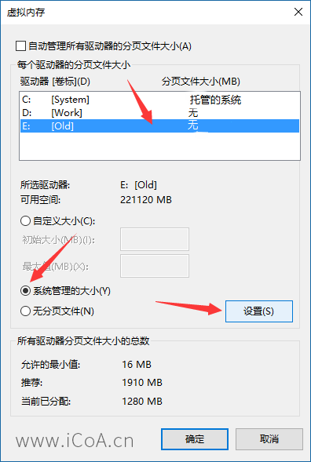


2.4 **设置完其他盘符的虚拟内存并重启**之后，选择【C盘】，点击【无分页文件】→【设置】，点击确定，重启即可。

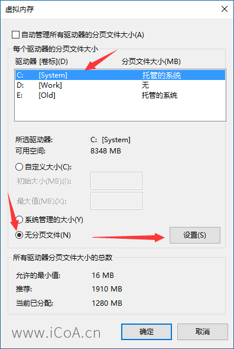

有些电脑，比如微软出的 Surface Laptop 是无法去掉C盘的虚拟内存的，这时候可以不去掉C盘虚拟内存，直接增加其他盘符的虚拟内存即可。

如果遇到提示：如果禁用分页文件，或将初始大小设置为少于800 MB并且发生了系统错误，WINDOWS可能不会记录可能有助于标识问题的详细信息，确实要继续吗？

因为已经设置了其他盘的虚拟内存，那么这里可以点是。

## 3 第三步：将临时文件转移到其他盘符

**在D盘下面新建 Temp 文件夹**。然后再进行后面的设置。


3.1 按照第二步的第一个步骤，打开【系统属性】，然后点击下面的【环境变量】，打开环境变量设置窗口；

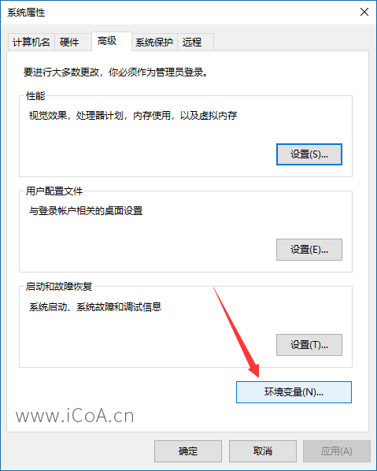

3.2 在打开的环境变量窗口，分别选择【用户变量】下面的【TEMP】和【TMP】变量，然后点击【编辑】，将【变量值】改为其他盘符的文件夹，比如这里改到了D盘下面的 Temp 文件夹（**此文件夹需要提前建好**），然后点击确定。

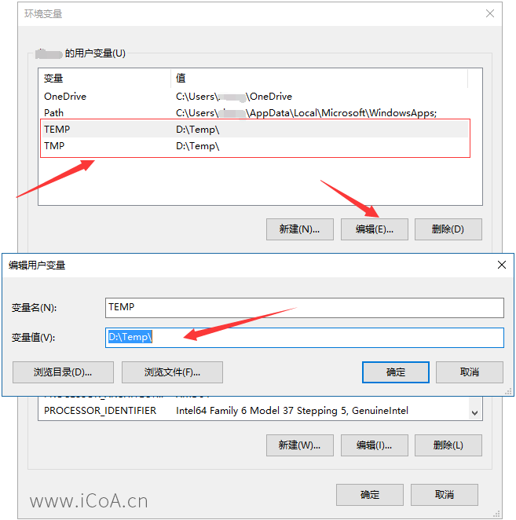

3.1.3 然后向下，找到【系统变量】里面的【TEMP】和【TMP】变量，跟上面的步骤相同，将【变量值】更改为其他盘符下面的文件夹，点确定。

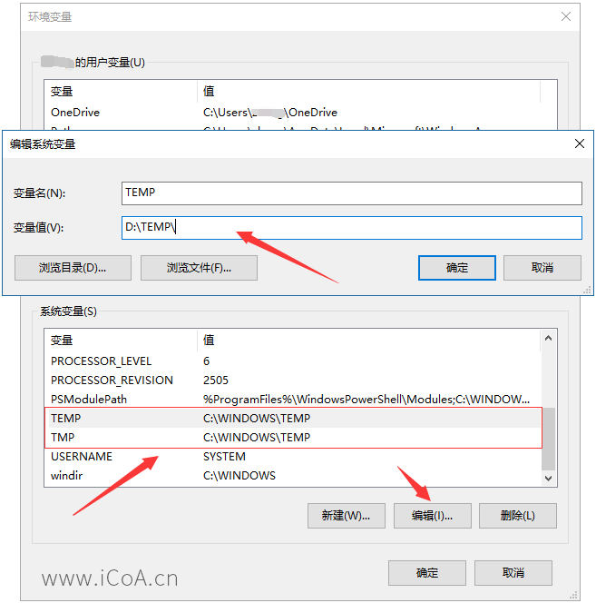

## 4 第四步：桌面、视频、图片、下载等转移到其他盘符

4.1 打开【此电脑】找到【桌面】文件夹，然后点右键选择【属性】，打开属性对话框；

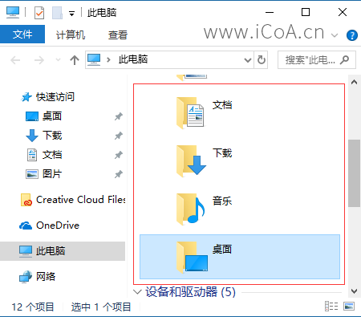

4.2 在打开的属性对话框里，选择【位置】标签，然后点击【移动】；

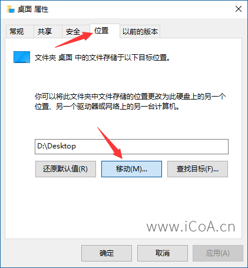

4.3 这时候，就可以打开其他分区，比如这里是E盘，**新建一个桌面文件夹**（文件夹名称不变，只是路径变了），并选中这个文件夹，点击下面的【选择文件夹】按钮。就可以了，如果原来桌面有文件的话，会有一个文件移动的过程，等文件复制完毕，就成功了。

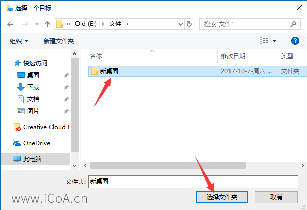

同样按照这个方法，可以将【文档】【下载】【图片】【音乐】【视频】等文件夹都转移到其他分区（**新建的对应文件夹里**）。这样C盘的可用空间会大很多，而且不会随着之后这些文件夹存的文件变多，而占用C盘空间了。

## 5 第四步：平时安装程序的时候，选择其他分区即可，这个比较简单

## 6 第五步：关闭系统的休眠功能

6.1 这个需要用到**以管理员身份运行的命令提示符**，方法有很多，比如：点击开始菜单旁边的搜索按钮，输入cmd，找到【命令提示符】。或者用你自己的方法，找到【命令提示符】。然后在【命令提示符】上点右键，选择【以管理员身份运行】，如果【提示允许此应用对你的设备进行更改吗？】，点【是】即可。

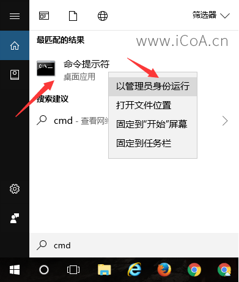

7.2 在打开的 【管理员：命令提示符】窗口，输入命令：**powercfg -h off**，然后回车就可以关闭系统休眠功能。

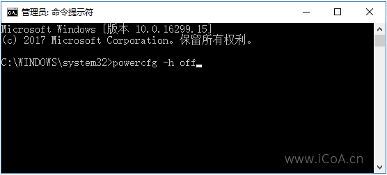

## 7 清理应用日志文件

双击“c盘清理.bat”即可

## 8 清理 Winsxs 文件夹

首先打开 管理员权限的 命令行或者 Powershell，然后执行下面的命令

```sh
Dism /online /Cleanup-Image /StartComponentCleanup
```
